Copyright (c) 2026 Jonas Baethke. All rights reserved.

TRUEOS uses a two-lane permission model under `LICENSE`: the first-party source
is source-available for public view, while official TRUEOS binary releases may
be used, run, evaluated, deployed, and commercially used.

Do not copy, publish, redistribute, clone, or build a 1:1 source-derived TRUEOS
from the first-party source without prior written permission. Blueprints,
scripts, applications, data, and configuration are the intended path for
extending and programming TRUEOS at runtime, including commercially.

```
TRUE OS § ® 2026
██████████████████████████████████████████████████████████████████████
██░        ░░       ░░░  ░░░░  ░░        ░░░░░░░░░      ░░░░      ░░██
██▒▒▒▒  ▒▒▒▒▒  ▒▒▒▒  ▒▒  ▒▒▒▒  ▒▒  ▒▒▒▒▒▒▒▒▒▒▒▒▒▒  ▒▒▒▒  ▒▒  ▒▒▒▒▒▒▒██
██▓▓▓▓  ▓▓▓▓▓       ▓▓▓  ▓▓▓▓  ▓▓      ▓▓▓▓▓▓▓▓▓▓  ▓▓▓▓  ▓▓▓      ▓▓██
██████  █████  ███  ███  ████  ██  ██████████████  ████  ████████  ███
██████  █████  ████  ███      ███        █████████      ████      ████
██████████████████████████████████████████████████████████████████████
A Rust Based 64 Bit Paged X84 Baremetal OS Targeted at modern Intel XeLp

Think of rust as the world’s quiet, slow-moving “entropy tax”:
A constant drain of resources, money, and safety.

Think of TRUE OS as the world’s fast-moving “entropy dividend”:
A constant influx of resources, money, and safety.
```

# Release is done entirely Upstream, via GitHub Actions
> [!Note]
> Makes it impossible to alter the build tools
> and sourcefiles are signed & included

## Cloud releases

Official public releases are built upstream by GitHub Actions:

`.github/workflows/release.yml` builds a clean checkout, packages the ISO bundle,
signs the release assets with the TRUEOS Ed25519 release key, uploads them as a
workflow artifact, and publishes a GitHub Release when you push a `v*` tag or
manually run the workflow with `publish_release=true`.

Manual workflow runs can leave `version` empty. The workflow then names the
release `0.0.<tools/cnt>` from the tracked release counter.

Set this repository secret before publishing:

- `TRUEOS_RELEASE_ED25519_KEY`: private TRUEOS Ed25519 release key JSON. Keep
  the matching public key in `TRUEOS-release-public-key.json`.

Release assets include:

- `TrueOS-<version>.7z`
- `TRUEOS-<version>.provenance.json`
- `SHA256SUMS`
- `.trueos-sig.json` signatures
- `TRUEOS-release-public-key.json`

Local `make release` is a fallback for reproducing the CI release path on your
own machine. It still requires a clean checkout, writes and verifies provenance,
then packages the same ISO bundle. By default provenance uses compact Git source
identity (`PROVENANCE_SOURCE_MANIFEST=git-commit`), so no large
`TRUEOS.source-files.sha256` block is bundled. For old-style per-file source
manifest audit work:

```bash
make release PROVENANCE_SOURCE_MANIFEST=git-index
```

Verifier flow:

```bash
sha256sum trueos.iso
python3 tools/provenance_chain.py verify \
  --source-root /path/to/TRUEOS-at-the-recorded-commit \
  --record /path/to/release/TRUEOS.provenance.json
```

The verifier recomputes the compact Git source identity for default releases and
checks the ISO hash named in `TRUEOS.provenance.json`. A wrong commit, swapped
submodule/gitlink, or replaced ISO breaks the chain. Release assets also include
`.trueos-sig.json` Ed25519 signatures and `TRUEOS-release-public-key.json`.


### C Tools
```
sudo apt update && sudo apt upgrade
sudo apt install graphviz npm git gh make rustup autoconf automake mtools nasm xorriso qemu-system gdb build-essential konsole gcc-aarch64-linux-gnu binutils-aarch64-linux-gnu
```

### Rust Tools 
```
cargo install fmt cargo-outdated cargo-edit --locked
rustup component add clippy
rustup toolchain install nightly --profile minimal --component rust-src,- - rustfmt,rust-analyzer,llvm-tools-preview
cargo install cargo-edit --locked
cargo install cargo-depgraph

```
### Vars
```
export CC_aarch64_unknown_none=aarch64-linux-gnu-gcc
export AR_aarch64_unknown_none=aarch64-linux-gnu-ar
```

## on MAC
> [!TIP]
> We were able to build, with a MAC Laptop aswell.
```
xcode-select --install
rustup toolchain install nightly
brew install llvm binutils autoconf automake libtool xorriso zstd p7zip
```

### Lic
> [!IMPORTANT]
> The source is public-view/protected. Official binaries are usable, including
> commercially. Blueprints are the legit extension path: they can change runtime
> behavior without being treated as prohibited source modification. Blueprints
> belong to their authors.

# Network Console Access
`konsole -e sh -c 'stty -echo -icanon cols 200 rows 60; nc 192.168.178.94 4245; stty sane'`

# Optional Section
> [!IMPORTANT]
> From here its mostly custom config that is emulator specific - OPTIONAL
> This may be your best resort to puzzle a network driver or usb host controller
> for your maybe unsupported hardware

## update
> [!WARNING]
> Unless you choose only linear and easy upgrades
> this i would recommend you dont move, it requires serious architecture knowledge
> to maintain the clear dep. Graph - that you maybe havent even seen

```
cargo outdated -R
cargo upgrade
cargo update
cargo clippy --fix --broken-code --bin "TRUEOS" -p TRUEOS
```

## nomachione with pxe 
> [!Note]
> Nomachine had some Port in use that i needed in some setting
> once atleast, for PXE so i had to move this, in order to preserve remote control
```
sudoedit /usr/NX/etc/server.cfg
UDPPort 50000-50999
sudo systemctl restart nxserver
```

## firewall
> [!Note]
> this mostly depends on what ports you assign, because currently
> i just casual use ports 0 to 10, so its kind of important
> to know that ports can be assigned way more toughtful - but i never encountered problems


## PASS IN USB DEVICE / NVMe data partition / VFIO permissions
> [!Note]
> passing in USB devices towards the emulator does cause
> for a more realistic debug scenario, but keep in mind that emulator
> has its entire universe of problems and behaviour, it remains a decent approach
> for a lot can be simpler to bringup 
sudo install -m 0644 99-trueos-usb.rules /etc/udev/rules.d/99-trueos-usb.rules
sudo udevadm control --reload-rules

### Castor mouse stays on the Linux host now; the rules file no longer auto-unbinds it.

sudo usermod -aG kvm "$USER"
newgrp kvm
id

sudo udevadm trigger --subsystem-match=block --subsystem-match=usb --subsystem-match=vfio
sudo udevadm trigger --name-match=nvme2n1p1
ls -l /dev/nvme2n1p1
ls -l /dev/vfio || true

### Optional: keep router/DHCP seeing the *same* MAC as the physical uplink
### (otherwise br0 may present a different MAC than $UPLINK)
sudo nmcli con mod "$BR" 802-3-ethernet.cloned-mac-address "$(cat /sys/class/net/$UPLINK/address)"
sudo nmcli con down "$BR" 2>/dev/null || true
sudo nmcli con up "$BR"

sudo nmcli con delete "$TAP" 2>/dev/null || true
if ! ip link show "$TAP" >/dev/null 2>&1; then
  sudo ip tuntap add dev "$TAP" mode tap user "$USER" group "$USER"
fi
sudo nmcli dev set "$TAP" managed no 2>/dev/null || true
sudo ip link set "$TAP" master "$BR"
sudo ip link set "$TAP" up
bridge link show
ip -4 -br addr show "$BR" "$UPLINK" "$TAP" 2>/dev/null || true
ip -4 route show default
ip -4 -br addr show | egrep "^($BR|$UPLINK|$TAP)\\b" || true

### VFIO USB CONTROLLER (no persist across reboot)
sudo modprobe vfio-pci
echo 0000:06:00.0 | sudo tee /sys/bus/pci/devices/0000:06:00.0/driver/unbind
echo vfio-pci | sudo tee /sys/bus/pci/devices/0000:06:00.0/driver_override
echo 0000:06:00.0 | sudo tee /sys/bus/pci/drivers/vfio-pci/bind
sudo bash -lc '
modprobe vfio vfio_pci vfio_iommu_type1

for dev in 0000:06:00.0 0000:06:00.1; do
  [ -e /sys/bus/pci/devices/$dev ] || continue
  echo vfio-pci > /sys/bus/pci/devices/$dev/driver_override
  echo $dev > /sys/bus/pci/drivers_probe
done

echo -n "IOMMU group: "
readlink -f /sys/bus/pci/devices/0000:06:00.0/iommu_group || true
ls -l /dev/vfio || true
lspci -nnk -s 06:00.0
'

### Whole dock / hub root to guest (preferred over usb-host hub passthrough)
QEMU's usb-host docs explicitly warn that passing a hub itself does not work reliably.
The robust path is to hand the guest the owning host controller so the guest becomes
the real USB root for that downstream tree.
In this setup the rear dock sits under:

   0000:06:00.0 ASMedia ASM3241 USB 3.2 Gen 2 Host Controller
   /sys/bus/usb/devices/4-1   -> SuperSpeed hub side
  /sys/bus/usb/devices/3-1   -> USB2 hub side

## Verify the mapping on the host:
readlink -f /sys/bus/usb/devices/4-1
readlink -f /sys/bus/usb/devices/3-1
lspci -nn -s 06:00.0
lsusb -t

## Then bind that controller to VFIO and boot with controller-root USB handoff:
sudo modprobe vfio vfio-pci vfio_iommu_type1
echo 0000:06:00.0 | sudo tee /sys/bus/pci/devices/0000:06:00.0/driver/unbind
echo vfio-pci | sudo tee /sys/bus/pci/devices/0000:06:00.0/driver_override
echo 0000:06:00.0 | sudo tee /sys/bus/pci/drivers_probe
lspci -nnk -s 06:00.0
ls -l /dev/vfio
make run QEMU_USB_MODE=controller QEMU_USB_CONTROLLER_PCI=0000:06:00.0

### This makes the VM own the physical USB root for the dock on that controller,
### which is much less fail-prone than trying to pass the dock hub via -device usb-host.

### dummy (no persist across reboot)
sudo ip link add NIC type dummy
sudo ip link set dev NIC address 5c:60:ba:b5:58:0f
Bus 003 Device 003: ID 0403:6010 Future Technology Devices International, Ltd FT2232C/D/H Dual UART/FIFO IC

cd /home/t4ce/REPOS/TRUEGA
sudo tools/flash_sram.sh


### LAN bridge for QEMU (rerunnable)
sudo nmcli con up br0-enp5s0
sudo nmcli con up br0
UPLINK=enp5s0
WIRED_CON="Kabelgebundene Verbindung 1"
BR=br0
SLAVE_CON="$BR-$UPLINK"   # -> br0-enp5s0
nmcli -t -f NAME con show | grep -Fxq "$BR" \
  || sudo nmcli con add type bridge ifname "$BR" con-name "$BR" ipv4.method auto ipv6.method ignore
sudo nmcli con mod "$BR" bridge.stp no bridge.forward-delay 0
nmcli -t -f NAME con show | grep -Fxq "$SLAVE_CON" \
  || sudo nmcli con add type bridge-slave ifname "$UPLINK" con-name "$SLAVE_CON" master "$BR"
sudo nmcli con mod "$WIRED_CON" connection.autoconnect no 2>/dev/null || true
sudo nmcli con down "$WIRED_CON" 2>/dev/null || true
sudo nmcli con up "$SLAVE_CON"
sudo nmcli con up br0

### one-time qemu-bridge-helper setup for unprivileged `make run`
BR=br0
HELPER=/usr/lib/qemu/qemu-bridge-helper
test -x "$HELPER" || HELPER=/usr/libexec/qemu-bridge-helper
sudo install -d -m 0755 /etc/qemu
printf 'allow %s\n' "$BR" | sudo tee /etc/qemu/bridge.conf
sudo chown root:root /etc/qemu/bridge.conf "$HELPER"
sudo chmod 0644 /etc/qemu/bridge.conf
sudo chmod u+s "$HELPER"
cat /etc/qemu/bridge.conf

### optional cleanup if you previously used the fixed tap0 setup
sudo nmcli con down tap0 2>/dev/null || true
sudo nmcli con delete tap0 2>/dev/null || true
sudo ip link del tap0 2>/dev/null || true
nmcli -t -f NAME,TYPE,DEVICE con show | grep -E '^br0:' || true
ip -br link show "$BR"

### if `ip -br link show "$BR"` reports `DOWN` / `NO-CARRIER`, the uplink is not attached to the bridge yet
nmcli -t -f NAME con show | grep -Fxq "$SLAVE_CON" \
  || sudo nmcli con add type bridge-slave ifname "$UPLINK" con-name "$SLAVE_CON" master "$BR"
sudo nmcli con up "$SLAVE_CON"
sudo nmcli con up "$BR"
bridge link show | grep -E "$BR|$UPLINK" || true


SUBSYSTEM=="usb", ENV{DEVTYPE}=="usb_device", ATTR{idVendor}=="2109", ATTR{idProduct}=="2813", MODE="0666", TAG+="uaccess"
SUBSYSTEM=="usb", ENV{DEVTYPE}=="usb_interface", ATTRS{idVendor}=="2109", ATTRS{idProduct}=="2813", RUN+="/bin/sh -c 'if [ -L /sys/bus/usb/devices/%k/driver ]; then echo %k > /sys/bus/usb/drivers/$(basename $(readlink -f /sys/bus/usb/devices/%k/driver))/unbind; fi'"
SUBSYSTEM=="usb", ENV{DEVTYPE}=="usb_device", ATTR{idVendor}=="0951", ATTR{idProduct}=="16a4", MODE="0666", TAG+="uaccess"
SUBSYSTEM=="usb", ENV{DEVTYPE}=="usb_interface", ATTRS{idVendor}=="0951", ATTRS{idProduct}=="16a4", RUN+="/bin/sh -c 'if [ -L /sys/bus/usb/devices/%k/driver ]; then echo %k > /sys/bus/usb/drivers/$(basename $(readlink -f /sys/bus/usb/devices/%k/driver))/unbind; fi'"
SUBSYSTEM=="usb", ENV{DEVTYPE}=="usb_device", ATTR{idVendor}=="303a", ATTR{idProduct}=="1001", MODE="0666", TAG+="uaccess"
SUBSYSTEM=="usb", ENV{DEVTYPE}=="usb_interface", ATTRS{idVendor}=="303a", ATTRS{idProduct}=="1001", RUN+="/bin/sh -c 'if [ -L /sys/bus/usb/devices/%k/driver ]; then echo %k > /sys/bus/usb/drivers/$(basename $(readlink -f /sys/bus/usb/devices/%k/driver))/unbind; fi'"
SUBSYSTEM=="usb", ENV{DEVTYPE}=="usb_device", ATTR{idVendor}=="058f", ATTR{idProduct}=="6387", MODE="0666", TAG+="uaccess"
SUBSYSTEM=="usb", ENV{DEVTYPE}=="usb_interface", ATTRS{idVendor}=="058f", ATTRS{idProduct}=="6387", RUN+="/bin/sh -c 'if [ -L /sys/bus/usb/devices/%k/driver ]; then echo %k > /sys/bus/usb/drivers/$(basename $(readlink -f /sys/bus/usb/devices/%k/driver))/unbind; fi'"
SUBSYSTEM=="usb", ENV{DEVTYPE}=="usb_device", ATTR{idVendor}=="07cf", ATTR{idProduct}=="6803", MODE="0666", TAG+="uaccess"
SUBSYSTEM=="usb", ENV{DEVTYPE}=="usb_interface", ATTRS{idVendor}=="07cf", ATTRS{idProduct}=="6803", RUN+="/bin/sh -c 'if [ -L /sys/bus/usb/devices/%k/driver ]; then echo %k > /sys/bus/usb/drivers/$(basename $(readlink -f /sys/bus/usb/devices/%k/driver))/unbind; fi'"
SUBSYSTEM=="usb", ENV{DEVTYPE}=="usb_device", ATTR{idVendor}=="1462", ATTR{idProduct}=="7e03", MODE="0666", TAG+="uaccess"
SUBSYSTEM=="usb", ENV{DEVTYPE}=="usb_interface", ATTRS{idVendor}=="1462", ATTRS{idProduct}=="7e03", RUN+="/bin/sh -c 'if [ -L /sys/bus/usb/devices/%k/driver ]; then echo %k > /sys/bus/usb/drivers/$(basename $(readlink -f /sys/bus/usb/devices/%k/driver))/unbind; fi'"

sudo modprobe vfio
sudo modprobe vfio-pci
sudo modprobe vfio_iommu_type1

ls /sys/bus/pci/drivers | grep vfio

echo 0000:00:02.0 | sudo tee /sys/bus/pci/devices/0000:00:02.0/driver/unbind
echo vfio-pci | sudo tee /sys/bus/pci/devices/0000:00:02.0/driver_override
echo 0000:00:02.0 | sudo tee /sys/bus/pci/drivers_probe

ls -l /dev/vfio
lspci -nnk -s 00:02.0

echo 0000:00:02.0 | sudo tee /sys/bus/pci/drivers/vfio-pci/bind
ls -l /dev/vfio
lspci -nnk -s 00:02.0
tee: /sys/bus/pci/drivers/vfio-pci/bind: No such file or directory (os error 2)
0000:00:02.0
total 0
crw-rw-rw- 1 root root 10, 196 Mar 16 21:47 vfio
00:02.0 Display controller [0380]: Intel Corporation Raptor Lake-S GT1 [UHD Graphics 770] [8086:a780] (rev 04)
        DeviceName: Onboard - Video
        Subsystem: Micro-Star International Co., Ltd. [MSI] Device [1462:7e03]
        Kernel modules: i915, xe
sudo reboot
sudo modprobe vfio-pci
sudo modprobe vfio_iommu_type1
echo vfio-pci | sudo tee /sys/bus/pci/devices/0000:00:02.0/driver_override
echo 0000:00:02.0 | sudo tee /sys/bus/pci/drivers_probe
ls -l /dev/vfio
lspci -nnk -s 00:02.0
echo 0000:00:02.0 | sudo tee /sys/bus/pci/devices/0000:00:02.0/driver/unbind
echo vfio-pci | sudo tee /sys/bus/pci/devices/0000:00:02.0/driver_override
echo 0000:00:02.0 | sudo tee /sys/bus/pci/drivers_probe

Use this on your Ubuntu 25.10 + GRUB host:

sudo tee /etc/modprobe.d/trueos-vfio-intel.conf >/dev/null <<'EOF'
options vfio-pci ids=8086:a780
softdep i915 pre: vfio-pci
softdep xe pre: vfio-pci
sudo tee -a /etc/initramfs-tools/modules >/dev/null <<'EOF'
vfio
vfio_pci
vfio_iommu_type1
GRUB_CMDLINE_LINUX_DEFAULT="quiet splash intel_iommu=on iommu=pt vfio-pci.ids=8086:a780"
sudo update-initramfs -u
sudo update-grub
sudo reboot


lspci -nnk -s 00:02.0
ls -l /dev/vfio


### whipe nvme
Claim To Host nvme

echo 0000:08:00.0 | sudo tee /sys/bus/pci/devices/0000:08:00.0/driver/unbind
echo nvme | sudo tee /sys/bus/pci/devices/0000:08:00.0/driver_override
echo 0000:08:00.0 | sudo tee /sys/bus/pci/drivers_probe
lspci -nnk -s 08:00.0
Expected:
Kernel driver in use: nvme

Wipe

sudo wipefs -a /dev/nvme2n1
sudo sgdisk --zap-all /dev/nvme2n1
sudo blkdiscard -f /dev/nvme2n1
sudo wipefs /dev/nvme2n1
sudo sgdisk -p /dev/nvme2n1
Expected:
wipefs shows nothing useful
sgdisk -p shows no valid GPT / empty disk

Claim To QEMU / VFIO

sudo modprobe vfio
sudo modprobe vfio-pci
sudo modprobe vfio_iommu_type1

echo 0000:08:00.0 | sudo tee /sys/bus/pci/devices/0000:08:00.0/driver/unbind
echo vfio-pci | sudo tee /sys/bus/pci/devices/0000:08:00.0/driver_override
echo 0000:08:00.0 | sudo tee /sys/bus/pci/drivers_probe
lspci -nnk -s 08:00.0
ls -l /dev/vfio


### rust-analyzer kernel-source smoke check

Use this from the repo root when you want rust-analyzer to load the TRUEOS custom
target and inspect only the kernel source tree. The `CARGO_UNSTABLE_JSON_TARGET_SPEC`
env var is needed because the repo target is `.cargo/x86_64-unknown-trueos.json`.
The skip flags keep the CLI pass lightweight and avoid the full-workspace/vendor
diagnostic noise.

```bash
CARGO_UNSTABLE_JSON_TARGET_SPEC=true \
SMOLTCP_IFACE_MAX_ADDR_COUNT=4 \
rust-analyzer analysis-stats . --only src \
  --skip-inference --skip-mir-stats --skip-data-layout --skip-const-eval
```

Retired shell2 etc/go spinner sequences, kept as glyph references:
go  = ⣿ ⣾ ⣽ ⣻ ⢿ ⡿ ⣟ ⣯ ⣷
go2 = ⢈ ⡈ ⡐ ⡠ ⣀ ⢄ ⢂ ⢁ ⡁

ConPink 	FF_55_FF 
ConBlue 	08_18_30
ConWhite 	FF_FF_FF


**bold**
*italic*
`inline code`
> This is a quote.
> [!TIP]
> [!WARNING]
> [!CAUTION]
> [!Note]

## Asset preview smoke test

<details>
<summary>Repository images and generated dependency graphs (161)</summary>

- `HorizonServer.png`  
  
- `logo.jpg`  
  
- `src/ui3/althlasfont/lucida-1x/atlas-g00.png`  
  
- `src/ui3/althlasfont/lucida-1x/atlas-g01.png`  
  
- `src/ui3/althlasfont/lucida-1x/atlas-g02.png`  
  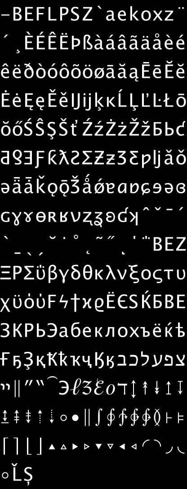
- `src/ui3/althlasfont/lucida-1x/atlas-g03.png`  
  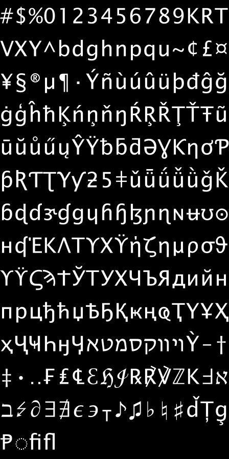
- `src/ui3/althlasfont/lucida-1x/atlas-g04.png`  
  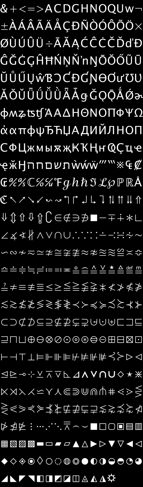
- `src/ui3/althlasfont/lucida-1x/atlas-g05.png`  
  
- `src/ui3/althlasfont/lucida-1x/atlas-g06.png`  
  
- `src/ui3/althlasfont/lucida-1x/atlas-g07.png`  
  
- `src/ui3/althlasfont/lucida-2x/atlas-g00.png`  
  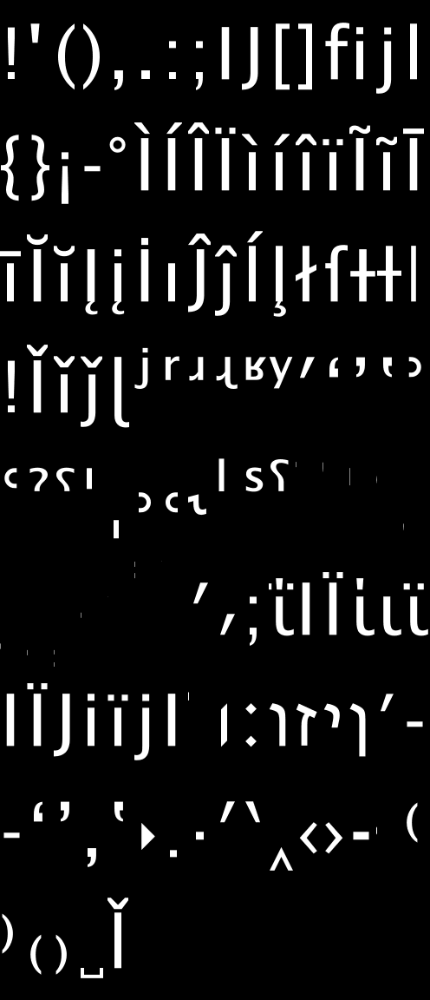
- `src/ui3/althlasfont/lucida-2x/atlas-g01.png`  
  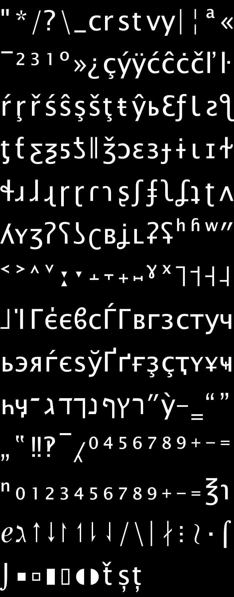
- `src/ui3/althlasfont/lucida-2x/atlas-g02.png`  
  
- `src/ui3/althlasfont/lucida-2x/atlas-g03.png`  
  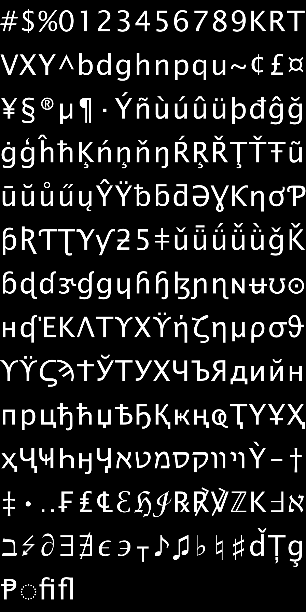
- `src/ui3/althlasfont/lucida-2x/atlas-g04.png`  
  
- `src/ui3/althlasfont/lucida-2x/atlas-g05.png`  
  
- `src/ui3/althlasfont/lucida-2x/atlas-g06.png`  
  
- `src/ui3/althlasfont/lucida-2x/atlas-g07.png`  
  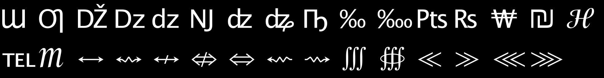
- `src/ui3/althlasfont/lucida-half/atlas-g00.png`  
  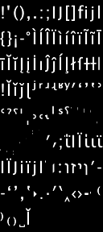
- `src/ui3/althlasfont/lucida-half/atlas-g01.png`  
  
- `src/ui3/althlasfont/lucida-half/atlas-g02.png`  
  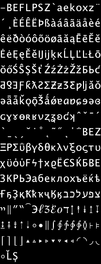
- `src/ui3/althlasfont/lucida-half/atlas-g03.png`  
  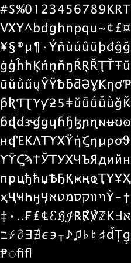
- `src/ui3/althlasfont/lucida-half/atlas-g04.png`  
  
- `src/ui3/althlasfont/lucida-half/atlas-g05.png`  
  
- `src/ui3/althlasfont/lucida-half/atlas-g06.png`  
  
- `src/ui3/althlasfont/lucida-half/atlas-g07.png`  
  
- `src/ui3/althlasfont/lucida-third/atlas-g00.png`  
  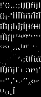
- `src/ui3/althlasfont/lucida-third/atlas-g01.png`  
  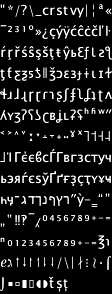
- `src/ui3/althlasfont/lucida-third/atlas-g02.png`  
  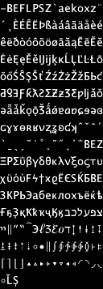
- `src/ui3/althlasfont/lucida-third/atlas-g03.png`  
  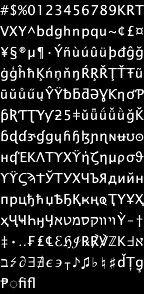
- `src/ui3/althlasfont/lucida-third/atlas-g04.png`  
  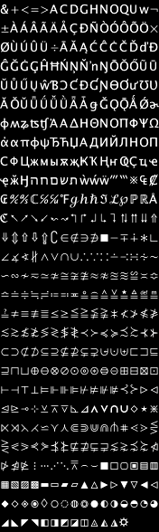
- `src/ui3/althlasfont/lucida-third/atlas-g05.png`  
  
- `src/ui3/althlasfont/lucida-third/atlas-g06.png`  
  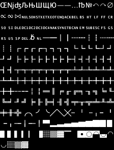
- `src/ui3/althlasfont/lucida-third/atlas-g07.png`  
  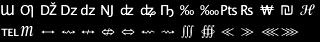
- `src/ui3/althlasfont/palatino-1x/atlas-g00.png`  
  
- `src/ui3/althlasfont/palatino-1x/atlas-g01.png`  
  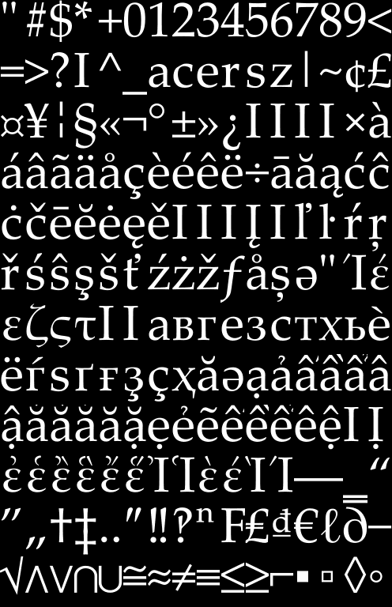
- `src/ui3/althlasfont/palatino-1x/atlas-g02.png`  
  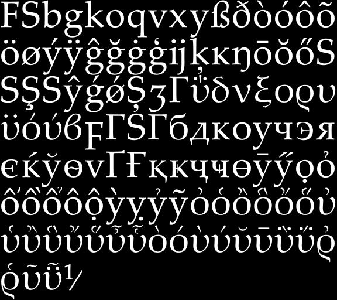
- `src/ui3/althlasfont/palatino-1x/atlas-g03.png`  
  
- `src/ui3/althlasfont/palatino-1x/atlas-g04.png`  
  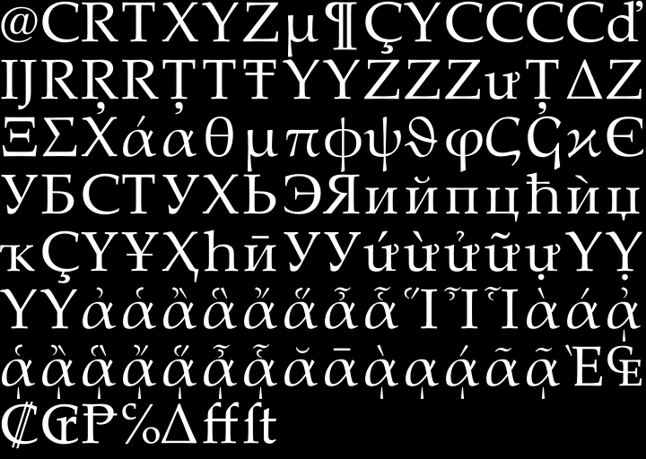
- `src/ui3/althlasfont/palatino-1x/atlas-g05.png`  
  
- `src/ui3/althlasfont/palatino-1x/atlas-g06.png`  
  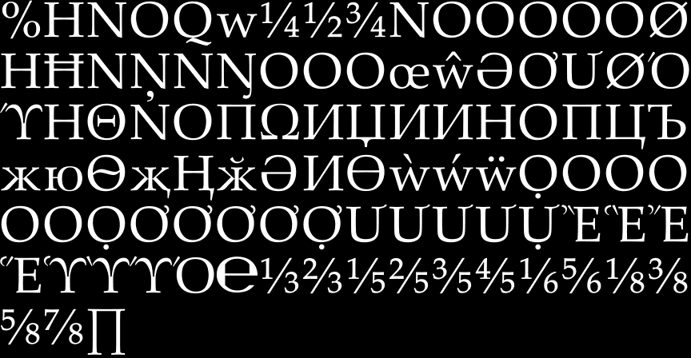
- `src/ui3/althlasfont/palatino-1x/atlas-g07.png`  
  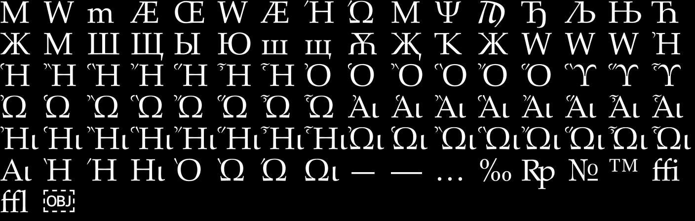
- `src/ui3/althlasfont/palatino-2x/atlas-g00.png`  
  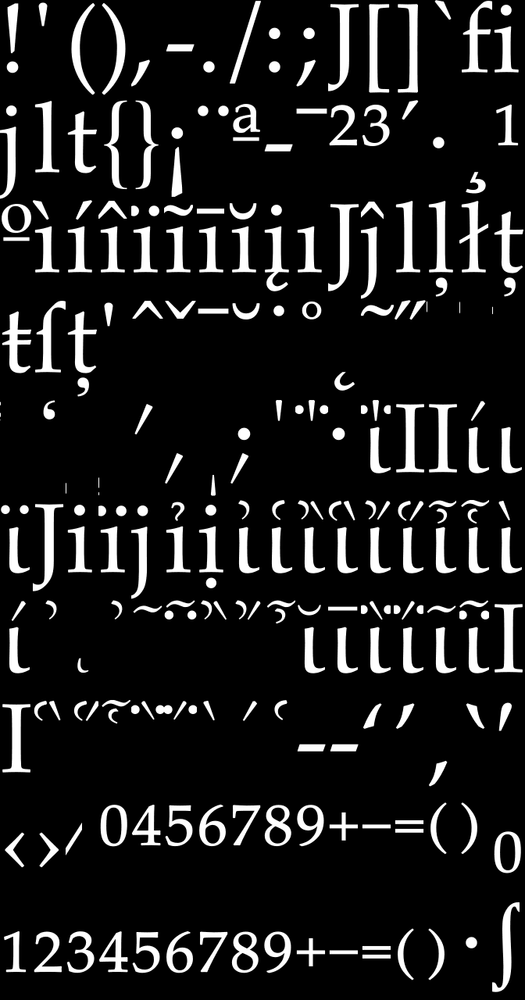
- `src/ui3/althlasfont/palatino-2x/atlas-g01.png`  
  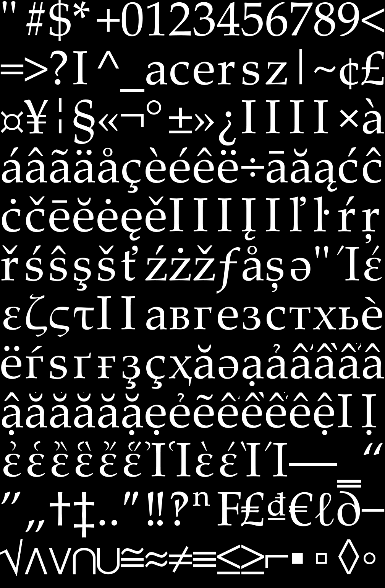
- `src/ui3/althlasfont/palatino-2x/atlas-g02.png`  
  
- `src/ui3/althlasfont/palatino-2x/atlas-g03.png`  
  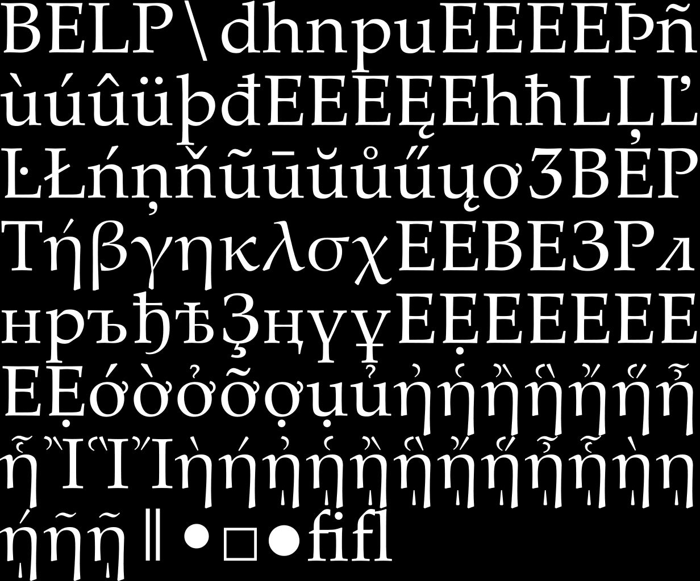
- `src/ui3/althlasfont/palatino-2x/atlas-g04.png`  
  
- `src/ui3/althlasfont/palatino-2x/atlas-g05.png`  
  
- `src/ui3/althlasfont/palatino-2x/atlas-g06.png`  
  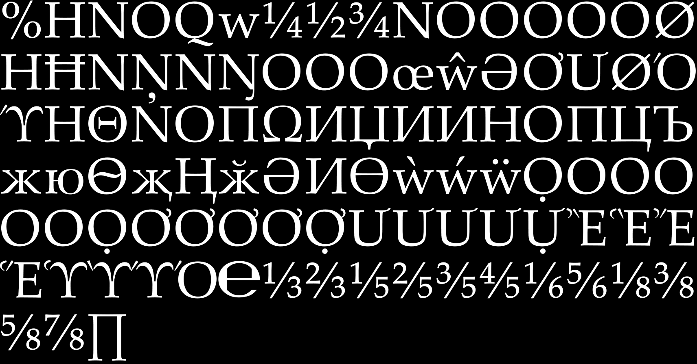
- `src/ui3/althlasfont/palatino-2x/atlas-g07.png`  
  
- `src/ui3/althlasfont/palatino-half/atlas-g00.png`  
  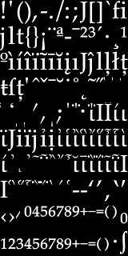
- `src/ui3/althlasfont/palatino-half/atlas-g01.png`  
  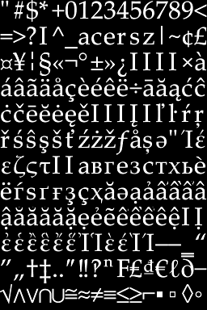
- `src/ui3/althlasfont/palatino-half/atlas-g02.png`  
  
- `src/ui3/althlasfont/palatino-half/atlas-g03.png`  
  
- `src/ui3/althlasfont/palatino-half/atlas-g04.png`  
  
- `src/ui3/althlasfont/palatino-half/atlas-g05.png`  
  
- `src/ui3/althlasfont/palatino-half/atlas-g06.png`  
  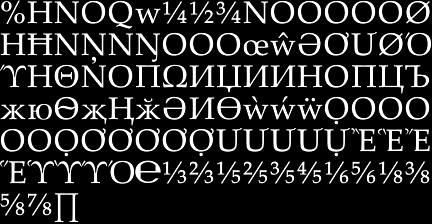
- `src/ui3/althlasfont/palatino-half/atlas-g07.png`  
  
- `src/ui3/althlasfont/palatino-third/atlas-g00.png`  
  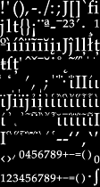
- `src/ui3/althlasfont/palatino-third/atlas-g01.png`  
  
- `src/ui3/althlasfont/palatino-third/atlas-g02.png`  
  
- `src/ui3/althlasfont/palatino-third/atlas-g03.png`  
  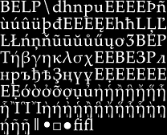
- `src/ui3/althlasfont/palatino-third/atlas-g04.png`  
  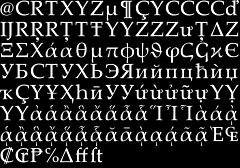
- `src/ui3/althlasfont/palatino-third/atlas-g05.png`  
  
- `src/ui3/althlasfont/palatino-third/atlas-g06.png`  
  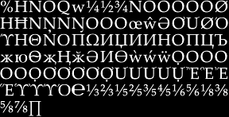
- `src/ui3/althlasfont/palatino-third/atlas-g07.png`  
  
- `src/ui3/althlasfont/twemoji-1x/atlas.png`  
  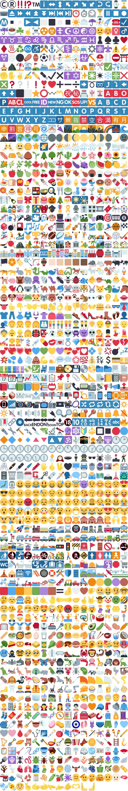
- `tools/depgraph/by-root/acpi-v6.1.1.svg`  
  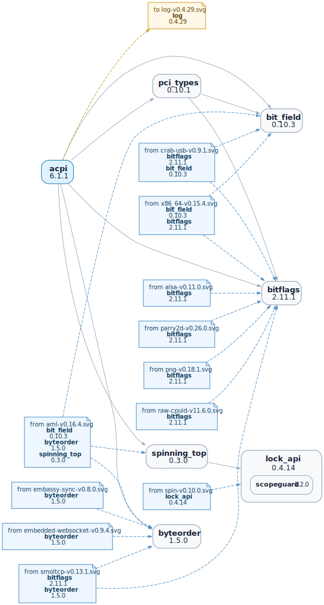
- `tools/depgraph/by-root/aes-v0.8.4.svg`  
  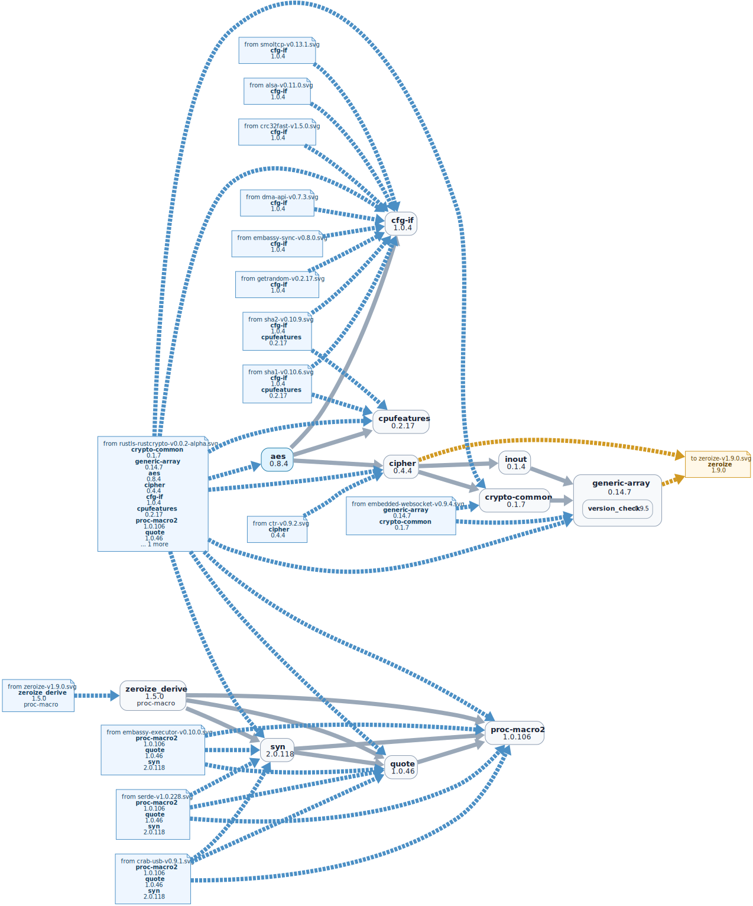
- `tools/depgraph/by-root/alsa-v0.11.0.svg`  
  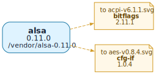
- `tools/depgraph/by-root/aml-v0.16.4.svg`  
  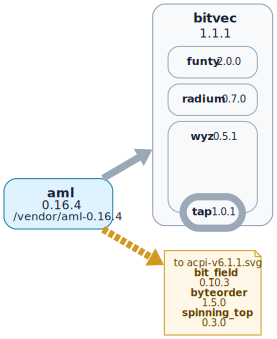
- `tools/depgraph/by-root/base64-v0.22.1.svg`  
  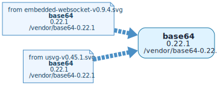
- `tools/depgraph/by-root/bytes-v1.12.0.svg`  
  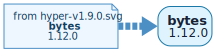
- `tools/depgraph/by-root/core3-v0.1.2.svg`  
  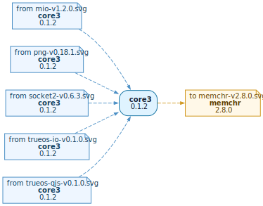
- `tools/depgraph/by-root/crab-usb-v0.9.1.svg`  
  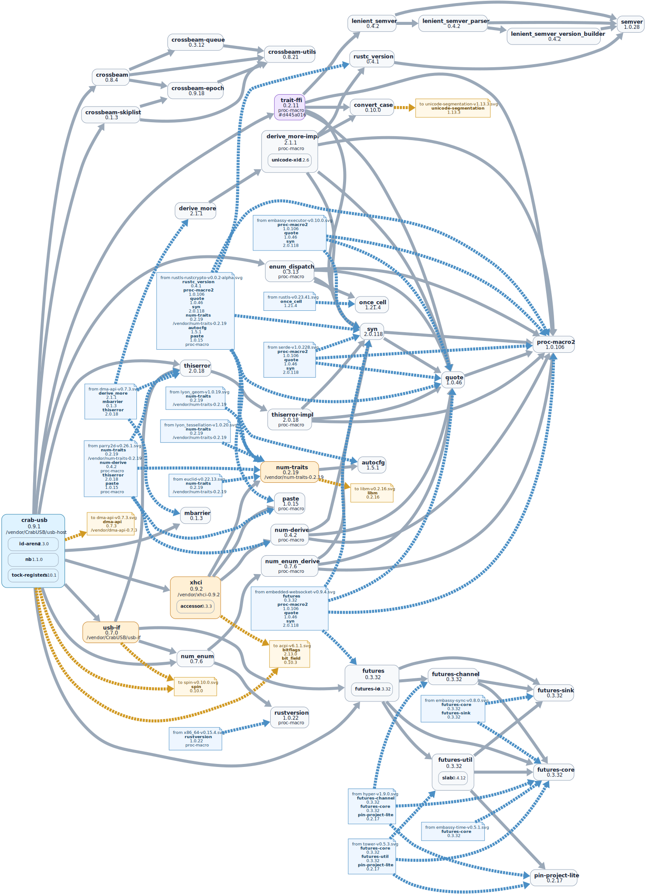
- `tools/depgraph/by-root/crc32fast-v1.5.0.svg`  
  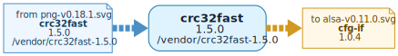
- `tools/depgraph/by-root/ctr-v0.9.2.svg`  
  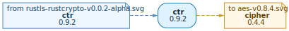
- `tools/depgraph/by-root/dma-api-v0.7.3.svg`  
  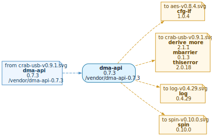
- `tools/depgraph/by-root/embassy-executor-v0.10.0.svg`  
  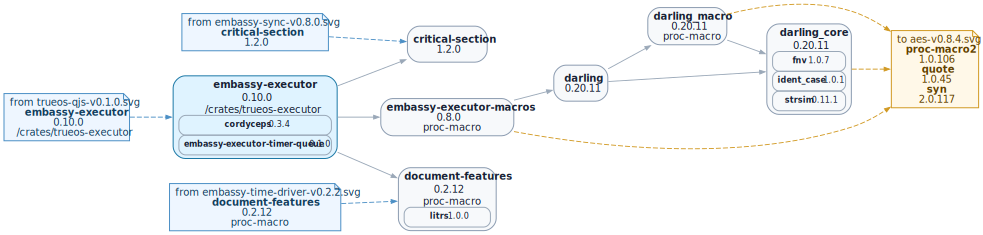
- `tools/depgraph/by-root/embassy-sync-v0.8.0.svg`  
  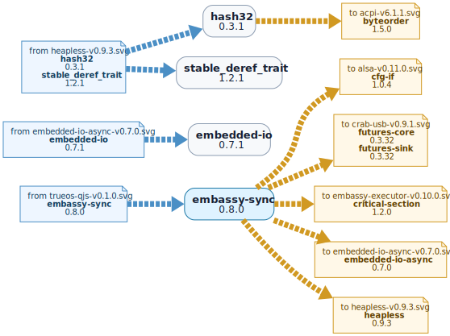
- `tools/depgraph/by-root/embassy-time-driver-v0.2.2.svg`  
  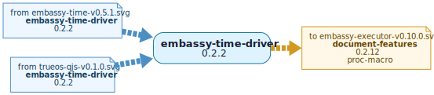
- `tools/depgraph/by-root/embassy-time-v0.5.1.svg`  
  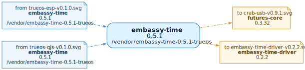
- `tools/depgraph/by-root/embedded-io-async-v0.7.0.svg`  
  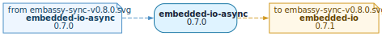
- `tools/depgraph/by-root/embedded-websocket-v0.9.4.svg`  
  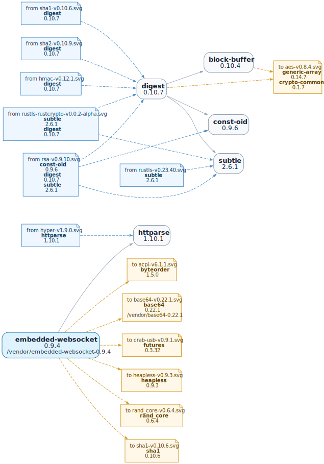
- `tools/depgraph/by-root/euclid-v0.22.13.svg`  
  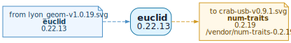
- `tools/depgraph/by-root/getrandom-v0.2.17.svg`  
  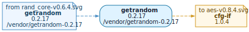
- `tools/depgraph/by-root/hashbrown-v0.17.1.svg`  
  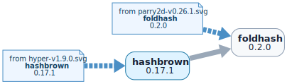
- `tools/depgraph/by-root/heapless-v0.9.3.svg`  
  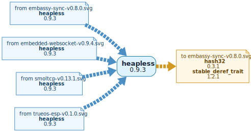
- `tools/depgraph/by-root/hmac-v0.12.1.svg`  
  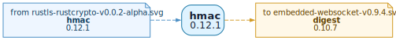
- `tools/depgraph/by-root/hyper-v1.9.0.svg`  
  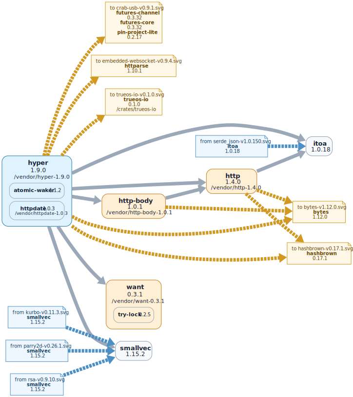
- `tools/depgraph/by-root/kurbo-v0.11.3.svg`  
  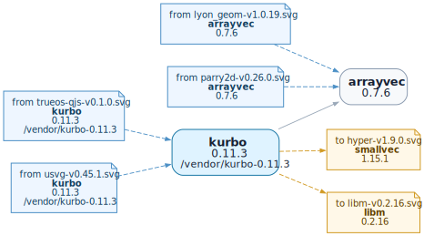
- `tools/depgraph/by-root/libm-v0.2.16.svg`  
  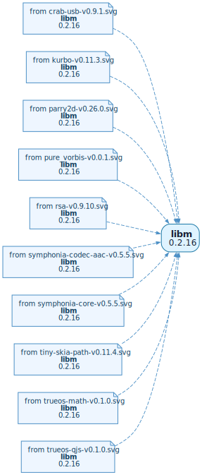
- `tools/depgraph/by-root/limine-v0.6.5.svg`  
  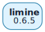
- `tools/depgraph/by-root/log-v0.4.33.svg`  
  
- `tools/depgraph/by-root/lyon_geom-v1.0.19.svg`  
  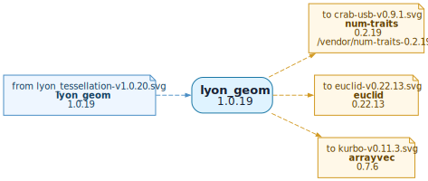
- `tools/depgraph/by-root/lyon_tessellation-v1.0.20.svg`  
  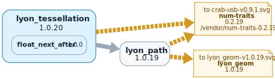
- `tools/depgraph/by-root/lzma-rust2-v0.16.4.svg`  
  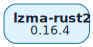
- `tools/depgraph/by-root/memchr-v2.8.2.svg`  
  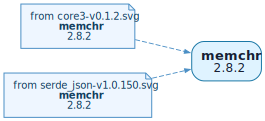
- `tools/depgraph/by-root/miniz_oxide-v0.9.1.svg`  
  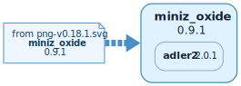
- `tools/depgraph/by-root/mio-v1.2.0.svg`  
  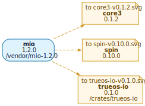
- `tools/depgraph/by-root/parry2d-v0.26.1.svg`  
  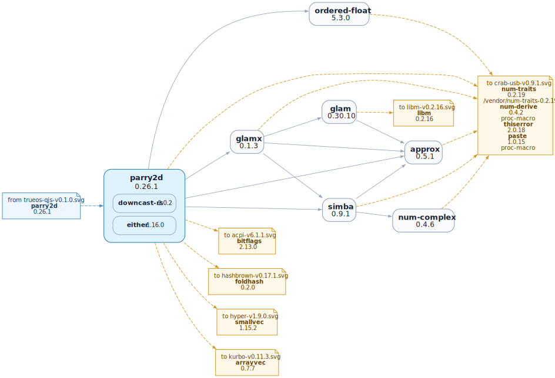
- `tools/depgraph/by-root/png-v0.18.1.svg`  
  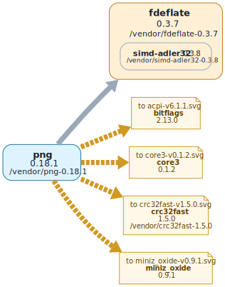
- `tools/depgraph/by-root/pure_vorbis-v0.0.1.svg`  
  
- `tools/depgraph/by-root/rand_chacha-v0.3.1.svg`  
  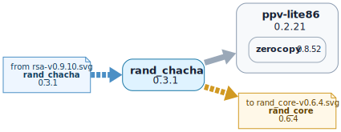
- `tools/depgraph/by-root/rand_core-v0.6.4.svg`  
  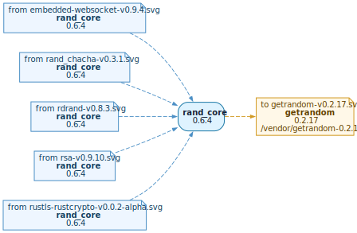
- `tools/depgraph/by-root/raw-cpuid-v11.6.0.svg`  
  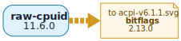
- `tools/depgraph/by-root/rdrand-v0.8.3.svg`  
  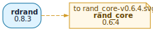
- `tools/depgraph/by-root/regex-automata-v0.4.14.svg`  
  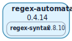
- `tools/depgraph/by-root/rsa-v0.9.10.svg`  
  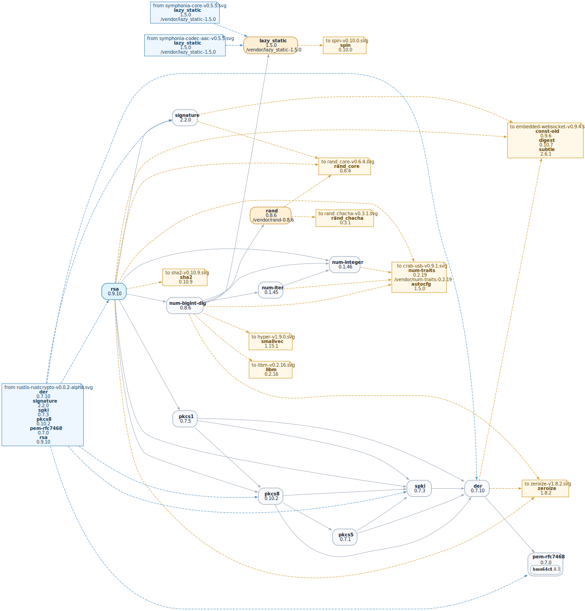
- `tools/depgraph/by-root/rustls-rustcrypto-v0.0.2-alpha.svg`  
  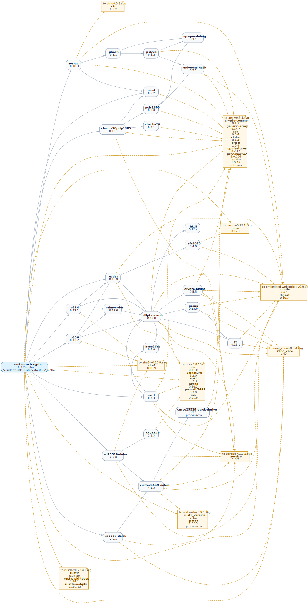
- `tools/depgraph/by-root/rustls-v0.23.41.svg`  
  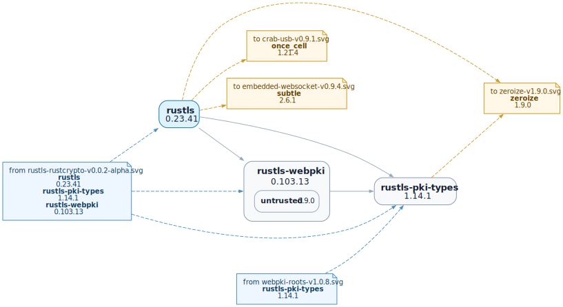
- `tools/depgraph/by-root/serde-v1.0.228.svg`  
  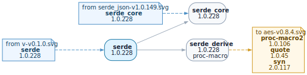
- `tools/depgraph/by-root/serde_json-v1.0.150.svg`  
  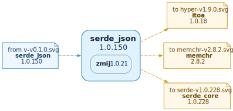
- `tools/depgraph/by-root/sha1-v0.10.6.svg`  
  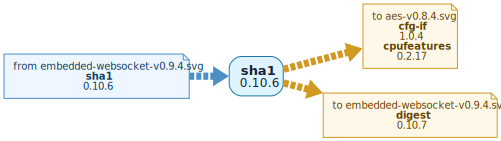
- `tools/depgraph/by-root/sha2-v0.10.9.svg`  
  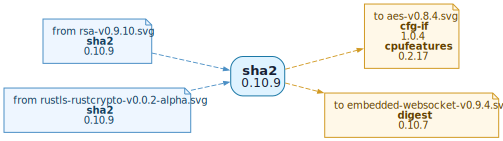
- `tools/depgraph/by-root/smoltcp-v0.13.1.svg`  
  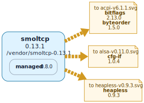
- `tools/depgraph/by-root/socket2-v0.6.3.svg`  
  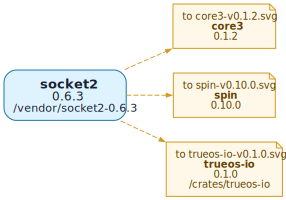
- `tools/depgraph/by-root/spin-v0.10.0.svg`  
  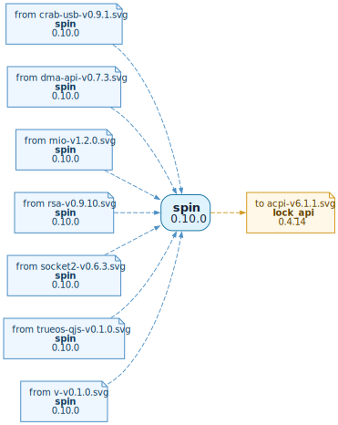
- `tools/depgraph/by-root/symphonia-codec-aac-v0.5.5.svg`  
  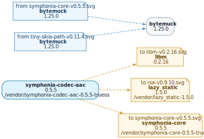
- `tools/depgraph/by-root/symphonia-core-v0.5.5.svg`  
  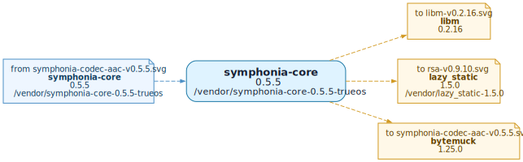
- `tools/depgraph/by-root/tiny-skia-path-v0.11.4.svg`  
  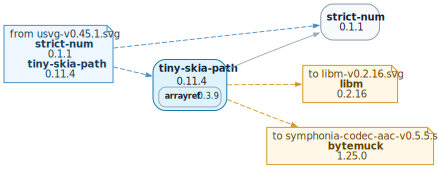
- `tools/depgraph/by-root/tinyaudio-v2.0.0.svg`  
  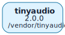
- `tools/depgraph/by-root/tower-v0.5.3.svg`  
  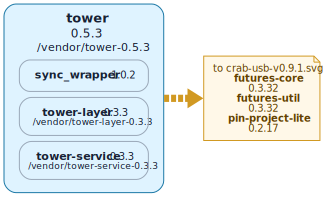
- `tools/depgraph/by-root/trueos-c4-v0.1.0.svg`  
  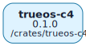
- `tools/depgraph/by-root/trueos-esp-v0.1.0.svg`  
  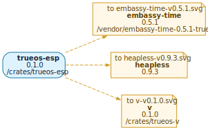
- `tools/depgraph/by-root/trueos-fs-v0.0.1.svg`  
  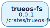
- `tools/depgraph/by-root/trueos-io-v0.1.0.svg`  
  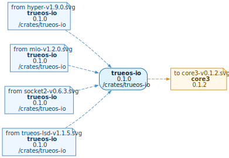
- `tools/depgraph/by-root/trueos-locale-v0.1.0.svg`  
  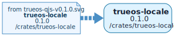
- `tools/depgraph/by-root/trueos-lsd-v1.1.5.svg`  
  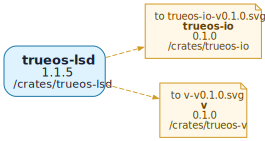
- `tools/depgraph/by-root/trueos-math-v0.1.0.svg`  
  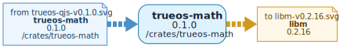
- `tools/depgraph/by-root/trueos-qjs-v0.1.0.svg`  
  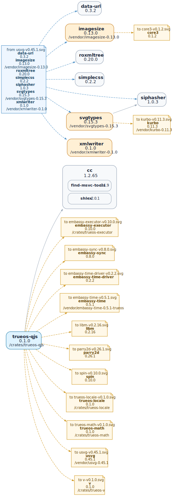
- `tools/depgraph/by-root/trueos-silk-v0.1.0.svg`  
  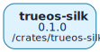
- `tools/depgraph/by-root/trueos-vm-v0.1.0.svg`  
  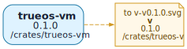
- `tools/depgraph/by-root/unicode-segmentation-v1.13.3.svg`  
  
- `tools/depgraph/by-root/usvg-v0.45.1.svg`  
  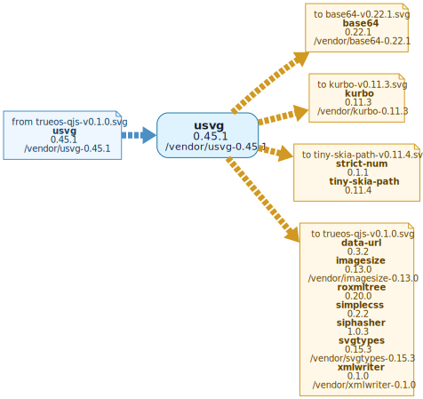
- `tools/depgraph/by-root/v-v0.1.0.svg`  
  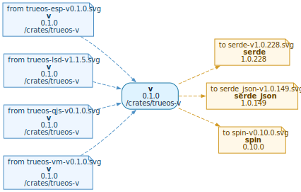
- `tools/depgraph/by-root/webpki-roots-v1.0.8.svg`  
  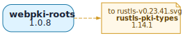
- `tools/depgraph/by-root/x86_64-v0.15.4.svg`  
  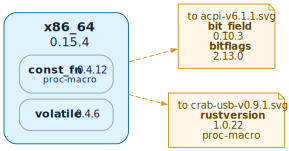
- `tools/depgraph/by-root/zeroize-v1.9.0.svg`  
  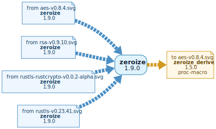
- `tools/depgraph/by-root/zune-core-v0.5.1.svg`  
  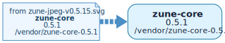
- `tools/depgraph/by-root/zune-jpeg-v0.5.15.svg`  
  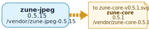
- `tools/depgraph/trueos-depth-tree.svg`  
  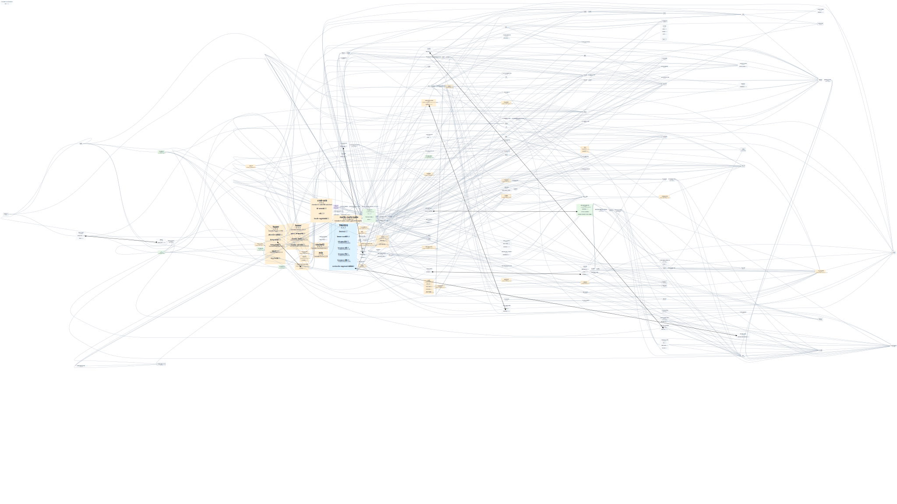
- `tools/vid/Buro4K.jpeg`  
  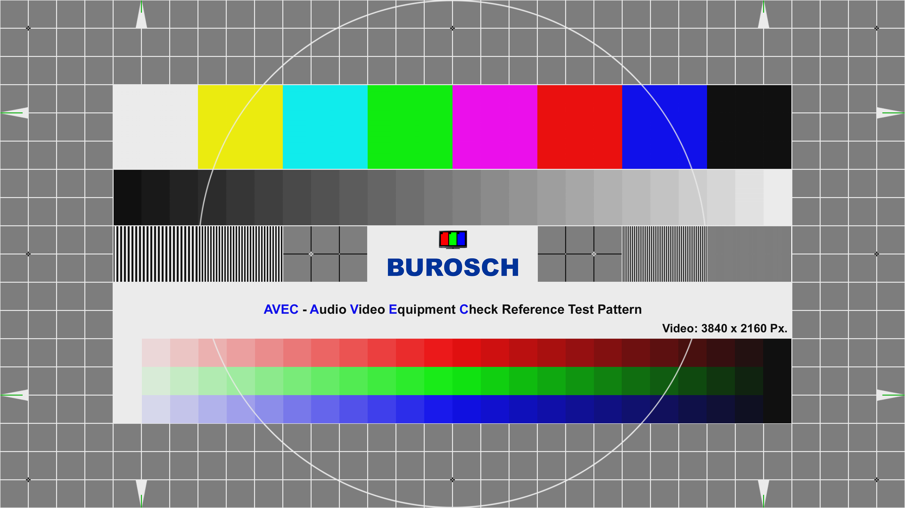
- `tools/vid/IMG_20260426_020424.jpg`  
  
- `tools/vid/Photo from 2026-04-26 02-00-42.935475.jpeg`  
  
- `tools/vid/YellyFHD.jpg`  
  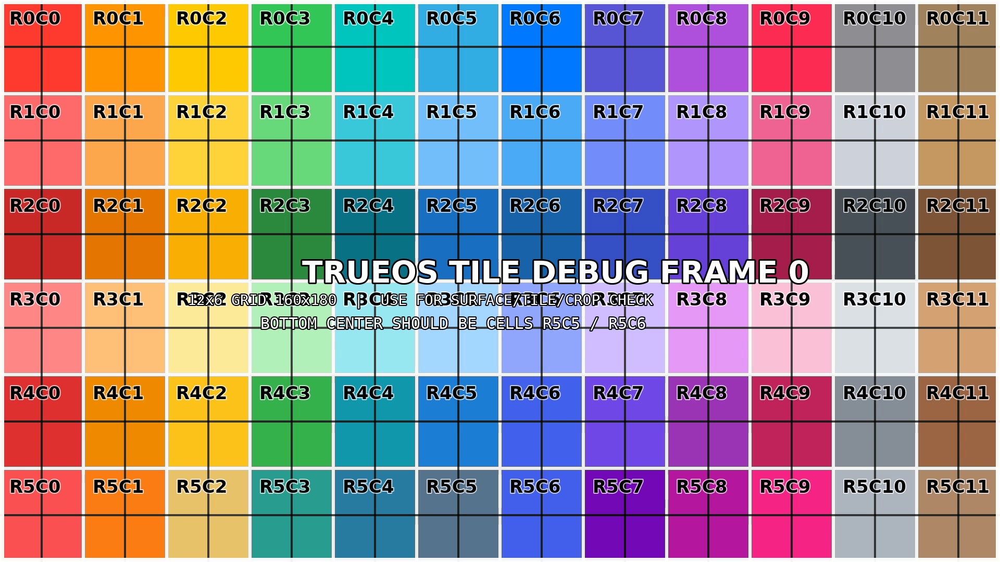
- `tools/vid/demo_yelly3_first_frame.png`  
  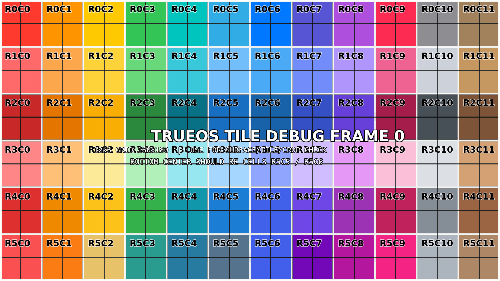
- `tools/vid/demo_yelly_first_frame.png`  
  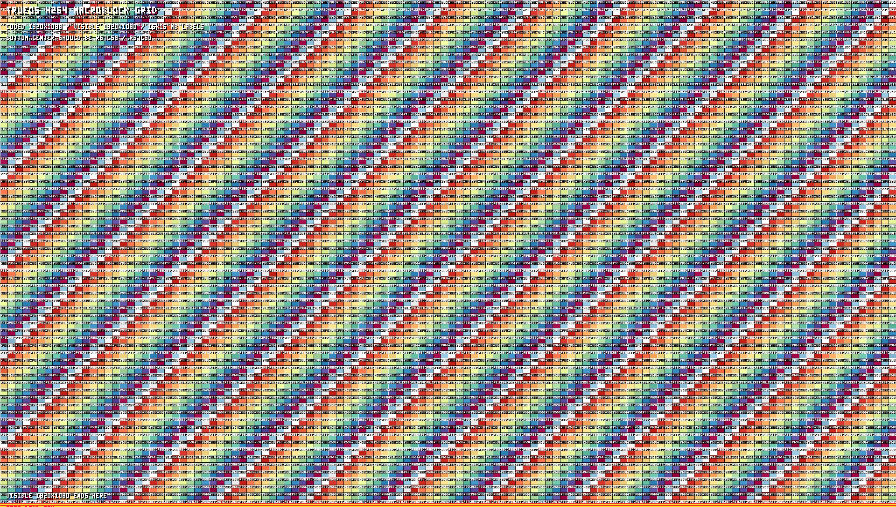
- `tools/vid/trueos_jpeg_diag_2560x1440.png`  
  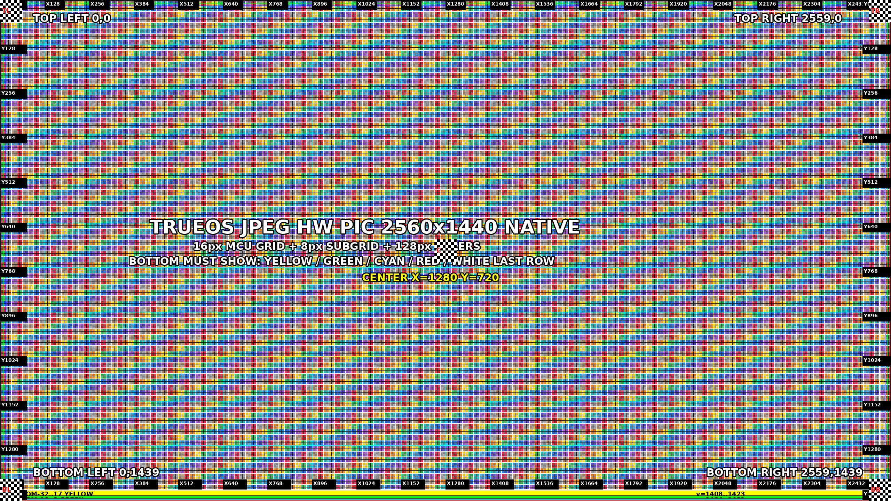
- `tools/vid/trueos_jpeg_diag_2560x1440_q95.jpg`  
  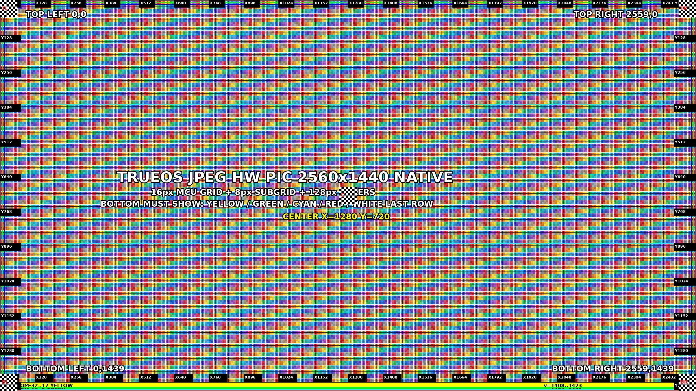
- `tools/vid/trueos_yellow_2560x1440_q90.jpg`  
  
- `vendor/CrabUSB/docs/layout.svg`  
  
- `vendor/CrabUSB/docs/异步请求.drawio.png`  
  
- `vendor/base64-0.22.1/icon_CLion.svg`  
  
- `vendor/limine/logo.png`  
  
- `vendor/limine/screenshot.png`  
  
- `vendor/limine/test/bg.jpg`  
  
- `vendor/limine/trueos_dist/src/logo.png`  
  
- `vendor/limine/trueos_dist/src/screenshot.png`  
  
- `vendor/limine/trueos_dist/src/test/bg.jpg`  
  

</details>
