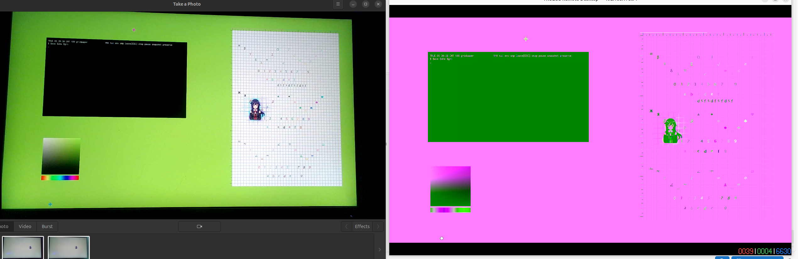
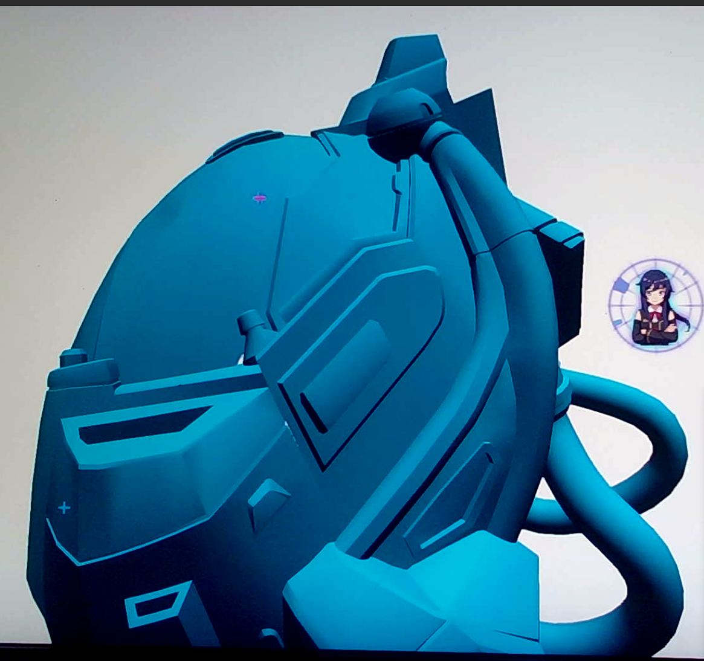
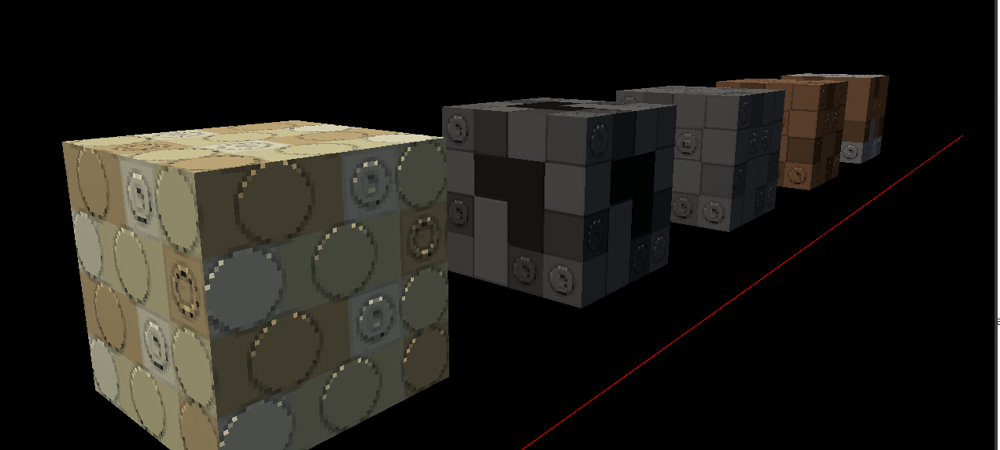

<p align="center">
  
</p>

<h1 align="center">TRUEOS</h1>

<p align="center">
  <strong>A vertically integrated Rust desktop OS for modern Intel graphics.</strong><br>
  Kernel, drivers, GPU runtime, compositor, media, services, application VMs, and developer tooling—built as one system.
</p>

<p align="center">
  <a href="https://github.com/t4ce/TRUEOS/releases/latest"></a>
  
  
  
</p>

TRUEOS is a from-scratch, `no_std`/`no_main`, x86-64 operating system. It is
not a Linux distribution, desktop theme, or userspace shell. It boots its own
kernel and directly owns the path from paging, SMP, interrupts, storage, and
networking through Intel display, render, copy, media, GPGPU, UI composition,
and application execution.

The project is well past the toy-kernel phase. It is now a large experimental
desktop/workstation stack with a Rust application compatibility effort, a
Blueprint VM runtime, real graphics and media output, remote UI streaming, and
repeatable QEMU and physical-hardware validation. The goal is a modern Rust
system that can eventually replace a conventional desktop OS for its supported
hardware—not a thin proof of concept around a boot screen.

> [!IMPORTANT]
> TRUEOS is still a research and development OS. Stage 4 is the current
> architectural generation, not a production-readiness label. The system has
> substantial working vertical slices, but it does not yet claim general Linux
> compatibility, production-secure multi-user isolation, broad hardware
> support, or complete OpenCL/media conformance.

## Start here

| If you want to… | Start with… |
| --- | --- |
| **Use TRUEOS** | The [latest official cloud release](https://github.com/t4ce/TRUEOS/releases/latest). It contains the supported bootable image, verification material, and launch guidance. |
| **Develop an application** | [TRUEOS-Blueprints](https://github.com/t4ce/TRUEOS-Blueprints), the primary application SDK, catalog, examples, compatibility ports, and Blueprint lifecycle repository. |
| **Understand the OS** | This repository and the [technical references](#technical-references) below: kernel, drivers, UI4, GPU, media, VM lifecycle, and architecture contracts. |
| **Extend the platform** | A Blueprint using mediated TRUEOS APIs. Kernel-source modification is not the normal application-development path. |

> [!TIP]
> **Application developers should treat
> [TRUEOS-Blueprints](https://github.com/t4ce/TRUEOS-Blueprints) as the main
> entry point.** This repository explains and implements the platform beneath
> it; platform implementation and maintainer deployment workflows are
> intentionally out of scope here.

## Scale of the current system

The repository changes quickly; these numbers are an August 2026 snapshot and
describe engineering surface area, not correctness:

| Surface | Current snapshot |
| --- | ---: |
| Tracked non-vendor Rust | approximately 485,000 lines |
| Repository-owned Cargo workspace | 33 members |
| Registered sibling Blueprint catalog | 44 applications and tools |
| Primary architecture | x86-64 UEFI bare metal |
| Primary graphics target | Intel Gen12 / Xe-LP, especially UHD 770 |
| Validation environments | physical Intel systems and QEMU/OVMF |

Several full-stack rewrites led to this generation. That history matters:
TRUEOS now spans the surface of a small desktop operating environment, but the
remaining work is also deeper than adding polish to a finished product.

## What exists today

| Area | Implemented system surface |
| --- | --- |
| **Kernel and execution** | UEFI/Limine boot, x86-64 paging and allocators, ACPI, exceptions, x2APIC, SMP and per-CPU state, asynchronous executors, worker domains, synchronization, profiling, and live-update machinery. |
| **Intel graphics** | Direct display ownership plus GGTT/PPGTT, GuC bring-up and submission, render, copy/BLT, media, GPGPU, native shader artifacts, hardware cursor/planes, and device-specific validation. |
| **Desktop and UI** | UI4 frame/window contracts, damage tracking, input routing, cursor and screenshot services, command/static/GPU/video surfaces, focus and layout state, remote display transport, and a four-display compositor model. |
| **3D and compute** | Picasso/Helio retained scenes, native Intel shader compilation, indexed and textured rendering, GPU work queues, OpenCL-shaped APIs, GPGPU operations, and CPU/GPU oracle tooling. |
| **Media and audio** | PNG/JPEG/BMP paths, video-frame publication, H.264 streaming and encode experiments, M4A/AAC work, an audio engine, synthesis, visualization, and Intel HDA/ALSA compatibility work. |
| **Applications** | Blueprints with VM principals, terminal handoff, pause, warm snapshot, persistent store/load, preserve/restore, peer transfer, TRUEOSFS scopes, vGPU/UI/media/network ABIs, and crash/lifecycle control. |
| **Rust ecosystem compatibility** | TRUEOS `std`/Unix ABI shims, file descriptors and sockets, `mio` readiness, Tokio carrier and blocking lanes, Hyper integration, async I/O, TLS, serde, redb, and a growing set of adapted crates and CLI tools. |
| **Platform services** | NVMe and PCI infrastructure, USB/xHCI work, Ethernet and Wi-Fi bring-up paths, IPv4/IPv6, DHCP, DNS, TCP/UDP, TLS/HTTP, printing, mail, clipboard, fonts, gamepads, and network discovery. |
| **Local AI** | Lumen LFM2.5 inference paths, CPU/VNNI and Intel GPGPU backends, Kokoro speech synthesis components, STT/TTS services, model packaging, parity tests, and bare-metal performance campaigns. |

Some rows combine production paths, physically validated experiments, and
work-in-progress compatibility layers. The detailed documents linked below
mark those boundaries more precisely.

## Current development captures

<table>
  <tr>
    <td width="50%"></td>
    <td width="50%"></td>
  </tr>
  <tr>
    <td><sub>UI4 composition on the physical display beside the live host viewer during streaming validation.</sub></td>
    <td><sub>Native Intel render output photographed on the target display during Stage 4 renderer work.</sub></td>
  </tr>
</table>

<p align="center">
  <br>
  <sub>Picasso/Helio retained and textured renderer development capture.</sub>
</p>

## One vertically owned stack

```text
Blueprints, ports, CLI tools, games, UI applications
                  │
        TRUEOS application and VM ABIs
                  │
      Blueprint lifecycle ── TRUEOSFS ── Shell2/Matrix
                  │                         │
          vGPU / media / input / network / terminal
                  │
      UI4 compositor, window graph, frames, video
                  │
 Picasso/Helio ── render ── GPGPU ── copy ── media
                  │
       Intel Gen12 display, GuC, GGTT and PPGTT
                  │
 SMP kernel, async runtime, memory, PCI, storage, USB, net
                  │
              x86-64 hardware
```

That ownership graph is the central experiment. TRUEOS can change a frame
contract, scheduler, VM ABI, shader package, and application runtime together
instead of negotiating a chain of independently versioned kernel, driver,
userspace, display-server, and toolkit interfaces. The advantage is speed and
coherence. The cost is a narrower compatibility envelope and a larger amount
of privileged code that still needs fault containment and adversarial review.

## Applications are Blueprints

Blueprints are TRUEOS's native application and extension format. They are not
kernel patches and do not require an application author to own the display,
network device, filesystem, or physical GPU. Each Blueprint runs as a VM
principal and reaches platform services through mediated Rust and C ABI
surfaces.

The dedicated [TRUEOS-Blueprints repository](https://github.com/t4ce/TRUEOS-Blueprints)
contains:

- the high-level [`trueos` application API](https://github.com/t4ce/TRUEOS-Blueprints/tree/main/api);
- the lower-level [`trueos-v` capability facade](https://github.com/t4ce/TRUEOS-Blueprints/tree/main/crates/trueos-v);
- the registered [`apps.json` catalog](https://github.com/t4ce/TRUEOS-Blueprints/blob/main/apps.json);
- applications, built-ins, compatibility probes, adapted ecosystem crates, and
  concrete UI, network, storage, media, and lifecycle examples;
- the pinned Blueprint-specific Rust contract and application packaging tools.

The current catalog spans graphical applications, terminal tools, games,
rendering demos, web/network software, editors, viewers, local AI, printing,
shells, and system utilities. Representative ports and applications include
Solara, HelioV/HelioC, Shadertoy, Lumen, Monaco, QuickJS, ripgrep, `fd`, SSH,
webmail, image viewing, Gridpaper, GBOI, and multiple Tokio/network probes.

### Application API surface

| Capability | Blueprint-facing model |
| --- | --- |
| **UI and input** | UI4 frames and windows, damage publication, routed keyboard/pointer events, cursors, print2D, images, and retained scene content. |
| **GPU and media** | Opaque vGPU resources, validated render packages, media playback/publication, audio, and host-owned presentation. Raw MMIO and physical addresses are not application APIs. |
| **Files and data** | Async filesystem access, TRUEOSFS scopes, per-instance writable roots, archives, and network-backed file services. |
| **Networking** | TCP/UDP-shaped services, HTTP/fetch, TLS-enabled ecosystem ports, mail and printing, plus Tokio/mio/socket compatibility where the selected Blueprint enables it. |
| **Runtime** | Poll/sleep, clocks, logging, environment, worker-local identity, blocking lanes, synchronization, and optional Tokio runtime features. |
| **Lifecycle** | Cooperative pause readiness, warm snapshots, persistent images, resume/replication identity, and explicit capability reacquisition. |
| **Terminal** | Shell2 stream output, styled text, terminal leases, TUI input, and VM control handoff. |

Start with the
[`hello_world` UI4 application](https://github.com/t4ce/TRUEOS-Blueprints/tree/main/apps/hello_world),
then use the
[`hello_world_replicatable` example](https://github.com/t4ce/TRUEOS-Blueprints/tree/main/apps/hello_world_replicatable)
for the cooperative lifecycle boundary. Larger examples include
[`Solara`](https://github.com/t4ce/TRUEOS-Blueprints/tree/main/apps/solara),
[`HelioV`](https://github.com/t4ce/TRUEOS-Blueprints/tree/main/apps/HelioV), and
[`Player`](https://github.com/t4ce/TRUEOS-Blueprints/tree/main/apps/Player).

Blueprint developer references live with the application platform:

- [API crate and feature surface](https://github.com/t4ce/TRUEOS-Blueprints/blob/main/api/Cargo.toml)
- [Pinned Rust application contract](https://github.com/t4ce/TRUEOS-Blueprints/blob/main/RUST_TOOLCHAIN.md)
- [Replicatable Blueprint lifecycle](https://github.com/t4ce/TRUEOS-Blueprints/blob/main/docs/replicatable-blueprints.md)
- [Async archive and filesystem model](https://github.com/t4ce/TRUEOS-Blueprints/blob/main/docs/async-archive.md)
- [Full application and built-in tree](https://github.com/t4ce/TRUEOS-Blueprints/tree/main/apps)

### Runtime lifecycle

Installed or online Blueprints can be discovered, verified, launched, paused,
snapshotted, stored, restored, preserved, stopped, or transferred between
peers. Persistent TRUEOSFS state remains host-owned and separate from a VM's
warm snapshot. Replicatable applications must release sockets, GPU queues, UI
windows, audio streams, and other live capabilities before reporting ready;
they reacquire those resources after resume or replication.

Shell2 is the user-facing operating surface rather than a Unix shell clone. It
has kernel-command and application modes. Matrix slots retain independent
command, application, and VM contexts, while the `§` operator navigates those
contexts. `§§<selector>` can fetch and launch an online Blueprint directly. A
terminal application may lease Shell2 for its TUI and later return control
without destroying its VM.

Blueprint publication is currently an internal/local deployment workflow, not
a claim of a stable general-purpose public package registry. The Blueprint
repository remains the authoritative place for the current application
toolchain and catalog contract.

## Hardware scope

TRUEOS deliberately targets a narrow Intel graphics family while the driver
stack is being made coherent. The current source recognizes these principal
display devices:

- Alder Lake-S GT1 (`0x4680`)
- Alder Lake-N / N100 UHD (`0x46D1`)
- Raptor Lake-S UHD 770 (`0xA780`)

Individual render, media, GPGPU, and shader paths may support only a subset or
even a specific revision. The checked-in shader artifacts are admission-checked
against their target rather than treated as portable binaries. QEMU is useful
for boot, service, and application validation; it is not evidence that a native
Intel acceleration path works on unrelated hardware.

## Official cloud releases

Download the [latest signed release](https://github.com/t4ce/TRUEOS/releases/latest).
That is the supported distribution path for users and application developers.
The release provides the bootable TRUEOS image, QEMU/OVMF launch bundle,
provenance record, checksums, Ed25519 signatures, public verification key, and
its own run guidance. The launch bundle boots the real TRUEOS image; it is not
a hosted reimplementation of the kernel.

Platform implementation and deployment procedures are maintainer concerns and
are deliberately not part of this README. They are not prerequisites for
understanding TRUEOS or developing against its Blueprint application model.

## Honest current boundaries

TRUEOS is ambitious, but its claims need to stay testable:

- **Not yet a general desktop replacement.** Hardware and application coverage
  are intentionally narrow compared with Linux, Windows, or macOS.
- **Not yet a production security boundary.** VM/Hull hardening, default-deny
  mappings, W^X policy, DMA/IOMMU isolation, speculation boundaries, and
  adversarial testing remain incomplete.
- **Not yet a conformant OpenCL platform.** The OpenCL-shaped surface and many
  native kernels are useful, but parts of execution and compatibility are
  still experimental or stubbed.
- **Not every media path is hardware-native.** CPU fallbacks, host oracles, and
  staged Intel media/SFC work coexist with direct hardware paths.
- **The UI failure domain is still too privileged.** Important compositor and
  service work currently runs as kernel tasks; restartable recovery and session
  survival are not yet proven end to end.
- **Interfaces still move quickly.** Stage 4 is consolidating contracts that
  have already gone through several architectural rewrites.

These limits do not make the demonstrated system “just a concept.” They define
the engineering work between a deep experimental OS and a dependable product.

## Stage 4 priorities

1. Stabilize the UI4, Picasso, Blueprint, VM, and resource-lifecycle contracts.
2. Move untrusted workloads behind a demonstrably hardened isolation boundary.
3. Make display, GPU, and compositor recovery preserve application and session
   identity across injected failures.
4. Finish and measure native media/GPGPU paths while retaining deterministic
   CPU and host-oracle comparisons.
5. Expand hardware validation without pretending device-family similarity is
   compatibility proof.
6. Turn the porting work into repeatable compatibility suites and documented
   application support levels.
7. Productize installation, update, rollback, diagnostics, and recovery.

## Technical references

- [The Scanout Convention](tools/docs/trueos_linux_failure_boundary_whitepaper.md)
  — an equal-footing audit of TRUEOS and a conventional Linux desktop,
  including security and recovery gaps.
- [Mosaic four-display compositor](tools/docs/CompositorUI.html) — UI4 surface,
  focus, layout, overview, and multi-display ownership model.
- [Hypervisor State Atlas](tools/docs/docs/HYPERVISOR_STATE_MACHINE.html) — VM
  principal, Blueprint, pause, snapshot, restore, and teardown contracts.
- [Execution model](tools/docs/execution.html) — CPU/AP slots, async tasks,
  worker models, locks, barriers, and event ordering.
- [Intel UHD 770 target reference](tools/docs/intel-uhd770-cpu-reference.html) —
  target devices, shader assumptions, and primary-source trail.
- [Picasso DOM/SceneDB contract](tools/docs/PICASSO_DOM_SCENEDB_CONTRACT.md) and
  [renderer artifacts](picasso/README.md).
- [UI4 video playback](tools/docs/UI4_VIDEO_PLAYBACK.md),
  [H.264 stream contract](tools/docs/UI4_H264_UDP_STREAM.md), and
  [Intel media/SFC roadmap](tools/docs/intel_media_sfc_roadmap.md).
- [Dependency graph](tools/docs/depgraph/index.html) — repository and ecosystem
  dependency depth.

## Source and licensing

TRUEOS is **source-available, not open source**. The first-party source may be
viewed for personal review, security research, education, evaluation, and
reference. The license does not grant the usual right to modify, redistribute,
publish a fork, or ship a source-derived build without written permission.

Official, unmodified TRUEOS binary releases may be used, evaluated, deployed,
and commercially used. Blueprints are the supported runtime extension path,
including for commercial work, and independent Blueprint authors retain their
own rights subject to their dependencies.

Read the [TRUEOS license](lic/TrueOS.LICENSE), [project notice](lic/NOTICE), and
[third-party notices](lic/THIRD_PARTY_NOTICES.md) before using the source or
redistributing any component. To propose source work, request permission from
the copyright holder first; audits and actionable issue reports are welcome.

Copyright © 2026 Jonas Baethke. All rights reserved.
