```
TRUE OS § ® 2026
██████████████████████████████████████████████████████████████████████
██░        ░░       ░░░  ░░░░  ░░        ░░░░░░░░░      ░░░░      ░░██
██▒▒▒▒  ▒▒▒▒▒  ▒▒▒▒  ▒▒  ▒▒▒▒  ▒▒  ▒▒▒▒▒▒▒▒▒▒▒▒▒▒  ▒▒▒▒  ▒▒  ▒▒▒▒▒▒▒██
██▓▓▓▓  ▓▓▓▓▓       ▓▓▓  ▓▓▓▓  ▓▓      ▓▓▓▓▓▓▓▓▓▓  ▓▓▓▓  ▓▓▓      ▓▓██
██████  █████  ███  ███  ████  ██  ██████████████  ████  ████████  ███
██████  █████  ████  ███      ███        █████████      ████      ████
██████████████████████████████████████████████████████████████████████
A Rust Based 64 Bit Paged X84 Baremetal OS Targeted at modern Intel XeLp

Think of rust as the world’s quiet, slow-moving “entropy tax”:
A constant drain of resources, money, and safety.

Think of TRUE OS as the world’s fast-moving “entropy dividend”:
A constant influx of resources, money, and safety.
```

# TRUEOS — native Intel Gen12 3D rendering on bare metal

> “You can boot a tiny Rust OS and make it do real things.”

## Download TRUEOS

> [!TIP]
> **Ready-to-boot ISO:** [Download TRUEOS 0.0.189 (`.7z`, 6 MB)](https://github.com/t4ce/TRUEOS/releases/tag/v0.0.189)
>
> [Latest release and notes](https://github.com/t4ce/TRUEOS/releases/tag/v0.0.189) ·
> [All releases](https://github.com/t4ce/TRUEOS/releases) ·
> [SHA-256 checksums](https://github.com/t4ce/TRUEOS/releases/download/v0.0.189/SHA256SUMS) ·
> [Release public key](https://github.com/t4ce/TRUEOS/releases/download/v0.0.189/TRUEOS-release-public-key.json)

The release archive contains the bootable ISO, provenance record, firmware, and
one-command launchers for Linux and macOS. Use the latest-release link for
release notes, checksums, and signatures.

Copyright (c) 2026 Jonas Baethke. All rights reserved.

TRUEOS uses a two-lane permission model under `LICENSE`: the first-party source
is source-available for public view, while official TRUEOS binary releases may
be used, run, evaluated, deployed, and commercially used.

Do not copy, publish, redistribute, clone, or build a 1:1 source-derived TRUEOS
from the first-party source without prior written permission. Blueprints,
scripts, applications, data, and configuration are the intended path for
extending and programming TRUEOS at runtime, including commercially.

## Why it is interesting

- Tiny bootable ISO, currently around 5 MB
- Rust-first bare-metal runtime
- Video/JPEG/media playback experiments
- Async and parallel Rust workload support
- Blueprint-based runtime extension model
- Signed upstream GitHub Actions releases
- QEMU, VFIO, bridge networking, and hardware bring-up workflows

## Release builds and verification

> [!Note]
> Makes it impossible to alter the build tools
> and sourcefiles are signed & included

### Cloud releases - Batteries included

Official public releases are built upstream by GitHub Actions:

`.github/workflows/release.yml` builds a clean checkout, packages the ISO bundle,
signs the release assets with the TRUEOS Ed25519 release key, uploads them as a
workflow artifact, and publishes a GitHub Release when you push a `v*` tag or
manually run the workflow with `publish_release=true`.

Manual workflow runs can leave `version` empty. The workflow then names the
release `0.0.<tools/cnt>` from the tracked release counter.

Set this repository secret before publishing:

- `TRUEOS_RELEASE_ED25519_KEY`: private TRUEOS Ed25519 release key JSON. Keep
  the matching public key in `TRUEOS-release-public-key.json`.

Release assets include:

- `TrueOS-<version>.7z`
- `TRUEOS-<version>.provenance.json`
- `SHA256SUMS`
- `.trueos-sig.json` signatures
- `TRUEOS-release-public-key.json`

Local `make release` is a fallback for reproducing the CI release path on your
own machine. It still requires a clean checkout, writes and verifies provenance,
then packages the same ISO bundle. By default provenance uses compact Git source
identity (`PROVENANCE_SOURCE_MANIFEST=git-commit`), so no large
`TRUEOS.source-files.sha256` block is bundled. For old-style per-file source
manifest audit work:

```bash
make release PROVENANCE_SOURCE_MANIFEST=git-index
```

Verifier flow:

```bash
sha256sum trueos.iso
python3 tools/provenance_chain.py verify \
  --source-root /path/to/TRUEOS-at-the-recorded-commit \
  --record /path/to/release/TRUEOS.provenance.json
```

The verifier recomputes the compact Git source identity for default releases and
checks the ISO hash named in `TRUEOS.provenance.json`. A wrong commit, swapped
submodule/gitlink, or replaced ISO breaks the chain. Release assets also include
`.trueos-sig.json` Ed25519 signatures and `TRUEOS-release-public-key.json`.

### Tools
```
sudo apt install git make 7zip nodejs libigc2-tools rustup npm autoconf intel-ocloc  automake mtools nasm xorriso
rustup toolchain install nightly-2026-07-10
sudo apt-get install -y clang-21 llvm-spirv-21
vs-code
npm install express

git submodule update --init --recursive
```

### Lic
> [!IMPORTANT]
> The source is public-view/protected. Official binaries are usable, including
> commercially. Blueprints are the legit extension path: they can change runtime
> behavior without being treated as prohibited source modification. Blueprints
> belong to their authors.

# Network Console Access
`konsole -e sh -c 'stty raw -echo; exec nc 192.168.178.94 4245'`

### dummy (no persist across reboot)
sudo ip link add NIC type dummy
sudo ip link set dev NIC address 5c:60:ba:b5:58:0f

### rust-analyzer kernel-source smoke check

Use this from the repo root when you want rust-analyzer to load the TRUEOS custom
target and inspect only the kernel source tree. The `CARGO_UNSTABLE_JSON_TARGET_SPEC`
env var is needed because the repo target is `.cargo/x86_64-unknown-trueos.json`.
The skip flags keep the CLI pass lightweight and avoid the full-workspace/vendor
diagnostic noise.

```bash
CARGO_UNSTABLE_JSON_TARGET_SPEC=true \
SMOLTCP_IFACE_MAX_ADDR_COUNT=4 \
rust-analyzer analysis-stats . --only src \
  --skip-inference --skip-mir-stats --skip-data-layout --skip-const-eval
```

Retired shell2 etc/go spinner sequences, kept as glyph references:
go  = ⣿ ⣾ ⣽ ⣻ ⢿ ⡿ ⣟ ⣯ ⣷
go2 = ⢈ ⡈ ⡐ ⡠ ⣀ ⢄ ⢂ ⢁ ⡁

ConPink 	FF_55_FF 
ConBlue 	08_18_30
ConWhite 	FF_FF_FF

**bold**
*italic*
`inline code`
> This is a quote.
> [!TIP]
> [!WARNING]
> [!CAUTION]
> [!Note]

## Asset preview smoke test

<details>
<summary>Repository images and generated dependency graphs</summary>

- `tools/HorizonServer.png`  
  
- `logo.jpg`  
  
- `tools/docs/depgraph/by-root/acpi-v6.1.1.svg`  
  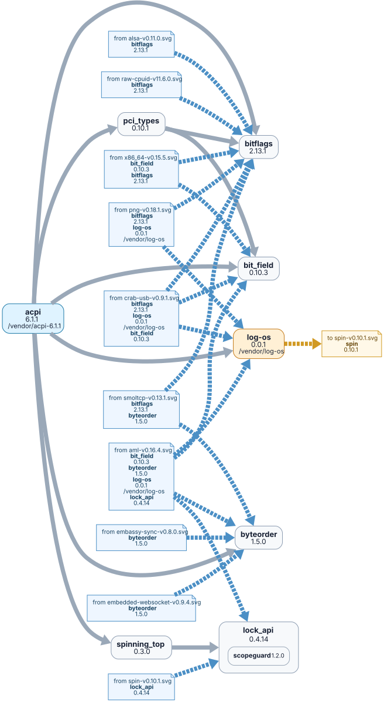
- `tools/docs/depgraph/by-root/alsa-v0.11.0.svg`  
  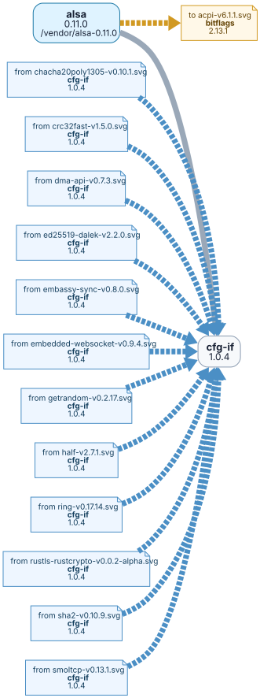
- `tools/docs/depgraph/by-root/aml-v0.16.4.svg`  
  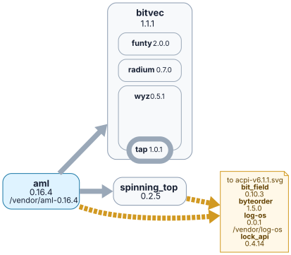
- `tools/docs/depgraph/by-root/bytes-v1.12.0.svg`  
  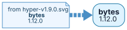
- `tools/docs/depgraph/by-root/core3-v0.1.2.svg`  
  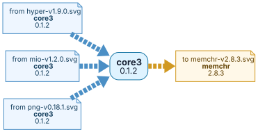
- `tools/docs/depgraph/by-root/crab-usb-v0.9.1.svg`  
  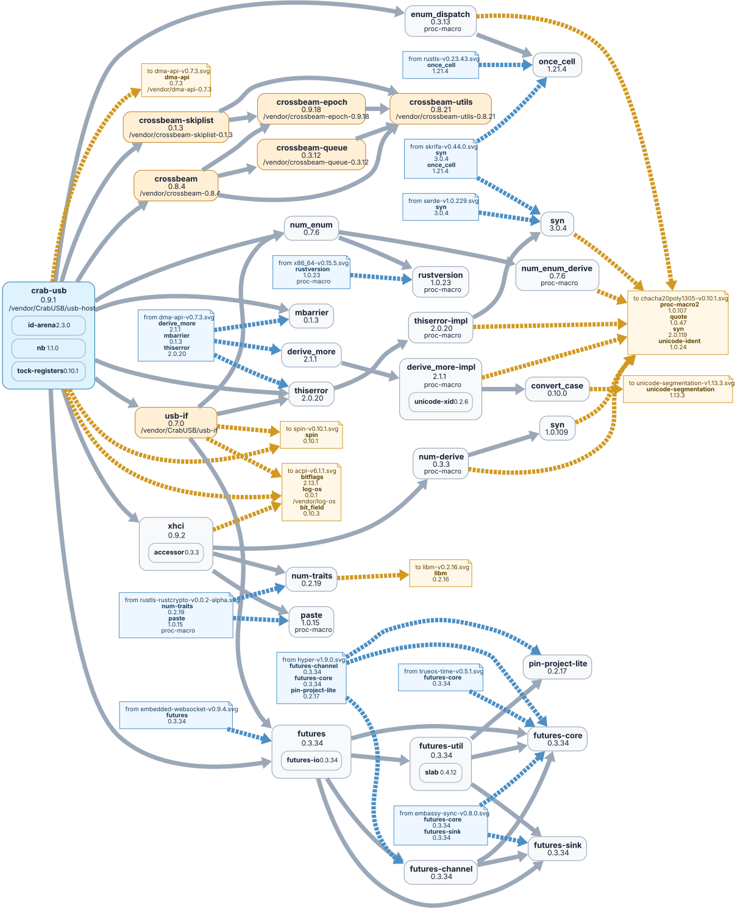
- `tools/docs/depgraph/by-root/crc32fast-v1.5.0.svg`  
  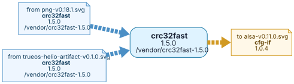
- `tools/docs/depgraph/by-root/dma-api-v0.7.3.svg`  
  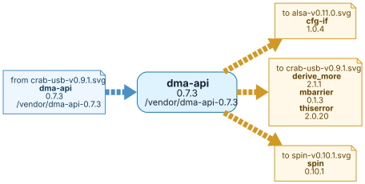
- `tools/docs/depgraph/by-root/embassy-executor-v0.10.0.svg`  
  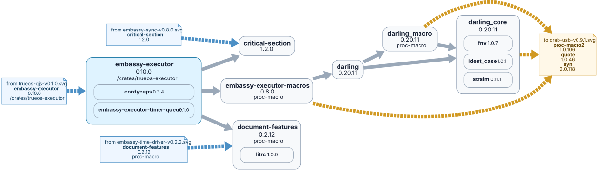
- `tools/docs/depgraph/by-root/embassy-sync-v0.8.0.svg`  
  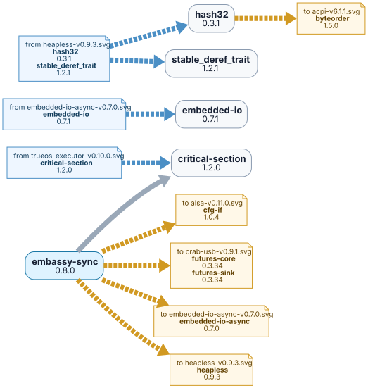
- `tools/docs/depgraph/by-root/embassy-time-driver-v0.2.2.svg`  
  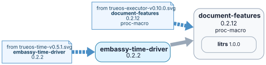
- `tools/docs/depgraph/by-root/embassy-time-v0.5.1.svg`  
  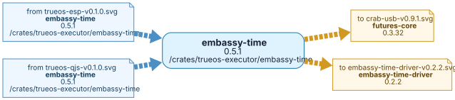
- `tools/docs/depgraph/by-root/embedded-io-async-v0.7.0.svg`  
  
- `tools/docs/depgraph/by-root/embedded-websocket-v0.9.4.svg`  
  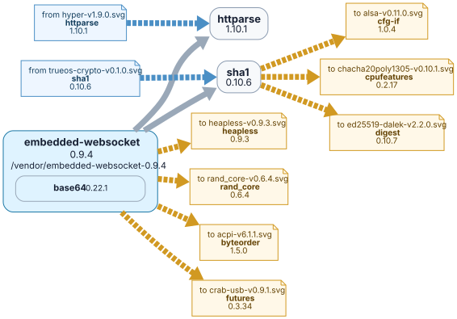
- `tools/docs/depgraph/by-root/euclid-v0.22.13.svg`  
  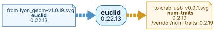
- `tools/docs/depgraph/by-root/getrandom-v0.2.17.svg`  
  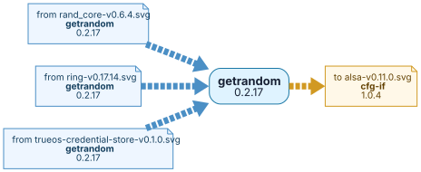
- `tools/docs/depgraph/by-root/hashbrown-v0.17.1.svg`  
  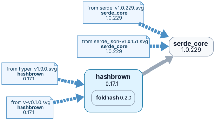
- `tools/docs/depgraph/by-root/heapless-v0.9.3.svg`  
  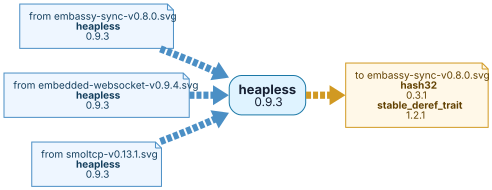
- `tools/docs/depgraph/by-root/hyper-v1.9.0.svg`  
  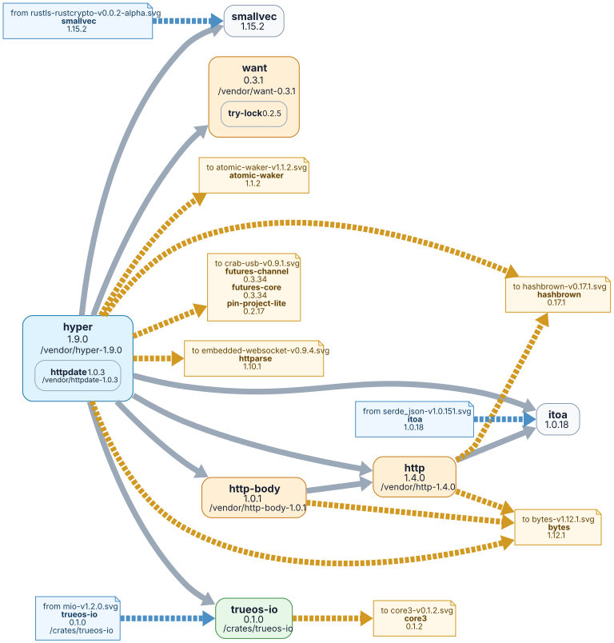
- `tools/docs/depgraph/by-root/kurbo-v0.11.3.svg`  
  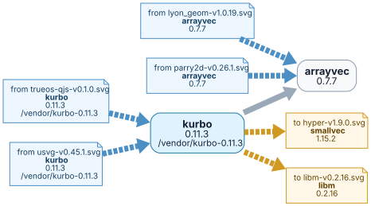
- `tools/docs/depgraph/by-root/libm-v0.2.16.svg`  
  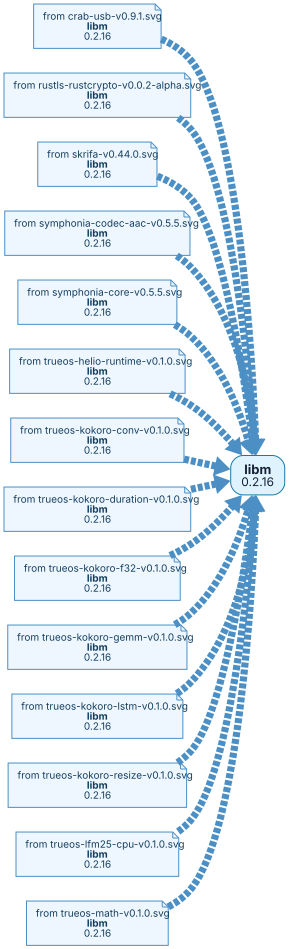
- `tools/docs/depgraph/by-root/limine-v0.6.5.svg`  
  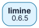
- `tools/docs/depgraph/by-root/lyon_geom-v1.0.19.svg`  
  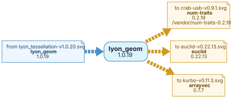
- `tools/docs/depgraph/by-root/lyon_tessellation-v1.0.20.svg`  
  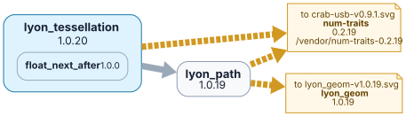
- `tools/docs/depgraph/by-root/lzma-rust2-v0.16.4.svg`  
  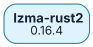
- `tools/docs/depgraph/by-root/memchr-v2.8.2.svg`  
  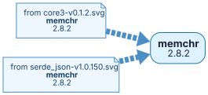
- `tools/docs/depgraph/by-root/miniz_oxide-v0.9.1.svg`  
  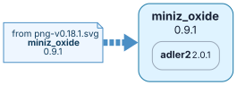
- `tools/docs/depgraph/by-root/mio-v1.2.0.svg`  
  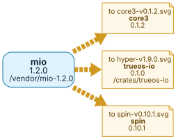
- `tools/docs/depgraph/by-root/parry2d-v0.26.1.svg`  
  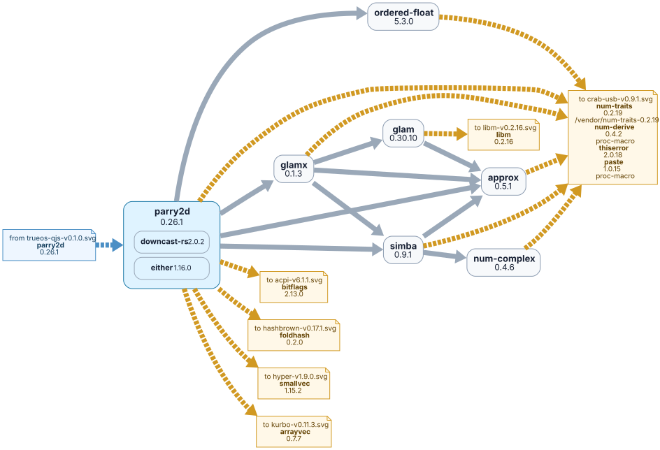
- `tools/docs/depgraph/by-root/png-v0.18.1.svg`  
  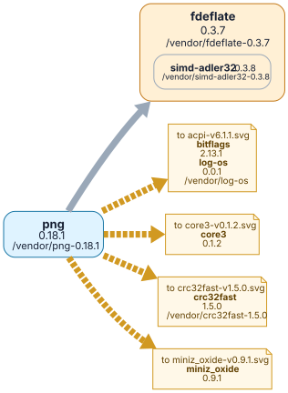
- `tools/docs/depgraph/by-root/rand_chacha-v0.3.1.svg`  
  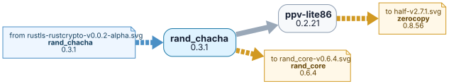
- `tools/docs/depgraph/by-root/rand_core-v0.6.4.svg`  
  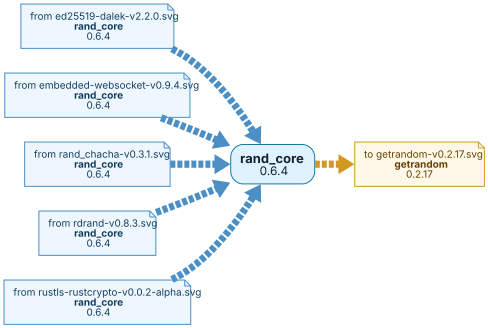
- `tools/docs/depgraph/by-root/raw-cpuid-v11.6.0.svg`  
  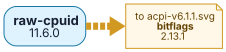
- `tools/docs/depgraph/by-root/rdrand-v0.8.3.svg`  
  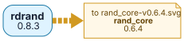
- `tools/docs/depgraph/by-root/regex-automata-v0.4.14.svg`  
  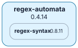
- `tools/docs/depgraph/by-root/rustls-rustcrypto-v0.0.2-alpha.svg`  
  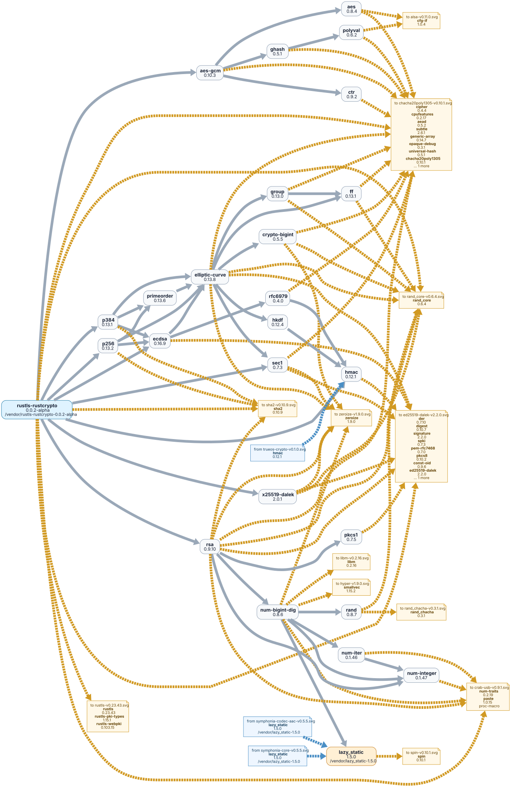
- `tools/docs/depgraph/by-root/rustls-v0.23.41.svg`  
  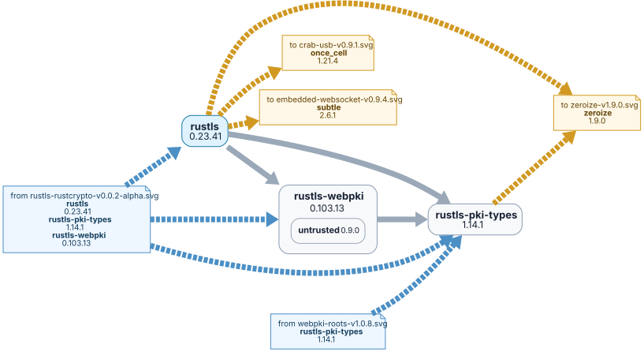
- `tools/docs/depgraph/by-root/serde-v1.0.228.svg`  
  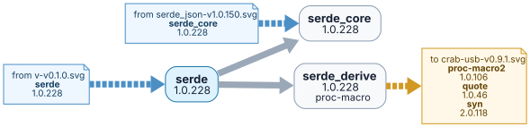
- `tools/docs/depgraph/by-root/serde_json-v1.0.150.svg`  
  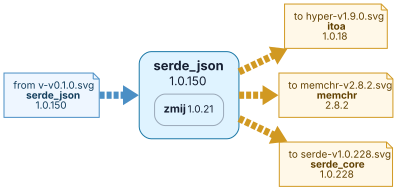
- `tools/docs/depgraph/by-root/sha2-v0.10.9.svg`  
  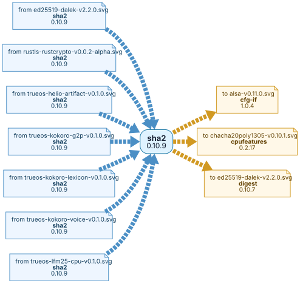
- `tools/docs/depgraph/by-root/smoltcp-v0.13.1.svg`  
  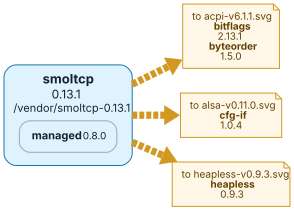
- `tools/docs/depgraph/by-root/socket2-v0.6.3.svg`  
  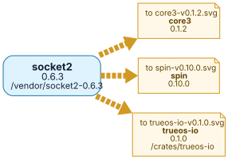
- `tools/docs/depgraph/by-root/spin-v0.10.0.svg`  
  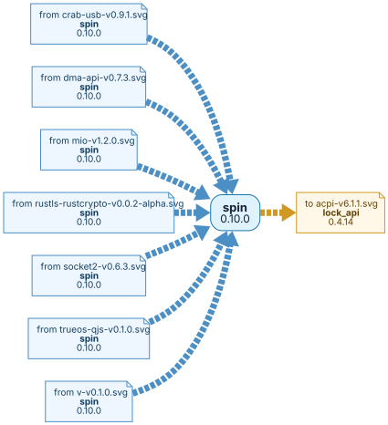
- `tools/docs/depgraph/by-root/symphonia-codec-aac-v0.5.5.svg`  
  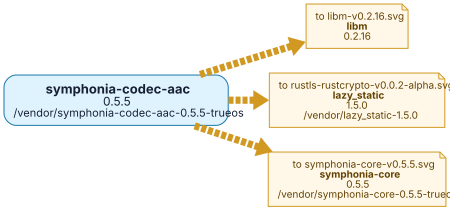
- `tools/docs/depgraph/by-root/symphonia-core-v0.5.5.svg`  
  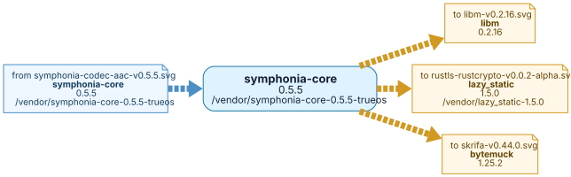
- `tools/docs/depgraph/by-root/tiny-skia-path-v0.11.4.svg`  
  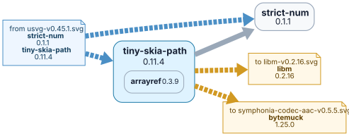
- `tools/docs/depgraph/by-root/tinyaudio-v2.0.0.svg`  
  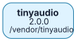
- `tools/docs/depgraph/by-root/tower-v0.5.3.svg`  
  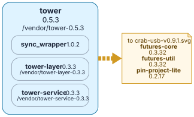
- `tools/docs/depgraph/by-root/trueos-esp-v0.1.0.svg`  
  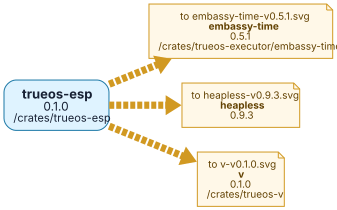
- `tools/docs/depgraph/by-root/trueos-fs-v0.0.1.svg`  
  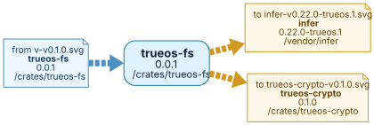
- `tools/docs/depgraph/by-root/trueos-io-v0.1.0.svg`  
  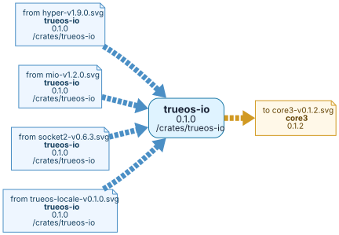
- `tools/docs/depgraph/by-root/trueos-locale-v0.1.0.svg`  
  
- `tools/docs/depgraph/by-root/trueos-math-v0.1.0.svg`  
  
- `tools/docs/depgraph/by-root/trueos-qjs-v0.1.0.svg`  
  
- `tools/docs/depgraph/by-root/trueos-vm-v0.1.0.svg`  
  
- `tools/docs/depgraph/by-root/unicode-segmentation-v1.13.3.svg`  
  
- `tools/docs/depgraph/by-root/usvg-v0.45.1.svg`  
  
- `tools/docs/depgraph/by-root/v-v0.1.0.svg`  
  
- `tools/docs/depgraph/by-root/webpki-roots-v1.0.8.svg`  
  
- `tools/docs/depgraph/by-root/x86_64-v0.15.4.svg`  
  
- `tools/docs/depgraph/by-root/zeroize-v1.9.0.svg`  
  
- `tools/docs/depgraph/by-root/zune-core-v0.5.1.svg`  
  
- `tools/docs/depgraph/by-root/zune-jpeg-v0.5.15.svg`  
  
- `tools/docs/depgraph/trueos-depth-tree.svg`  
  
- `tools/vid/Buro4K.jpeg`  
  
- `tools/vid/IMG_20260426_020424.jpg`  
  
- `tools/vid/Photo from 2026-04-26 02-00-42.935475.jpeg`  
  
- `tools/vid/YellyFHD.jpg`  
  
- `tools/vid/demo_yelly3_first_frame.png`  
  
- `tools/vid/demo_yelly_first_frame.png`  
  
- `tools/vid/trueos_jpeg_diag_2560x1440.png`  
  
- `tools/vid/trueos_jpeg_diag_2560x1440_q95.jpg`  
  
- `tools/vid/trueos_yellow_2560x1440_q90.jpg`  
  
- `vendor/CrabUSB/docs/layout.svg`  
  
- `vendor/CrabUSB/docs/异步请求.drawio.png`  
  
- `vendor/limine/logo.png`  
  
- `vendor/limine/screenshot.png`  
  
- `vendor/limine/test/bg.jpg`  
  
- `vendor/limine/logo.png`  
  
- `vendor/limine/screenshot.png`  
  
- `vendor/limine/test/bg.jpg`  
  

</details>
